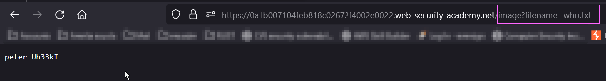

### Blind OS command injection with output redirection
#### Lab
The lab contains a blind OS command injection vulnerability in the feedback function.
The application executes a shell command containing the user-supplied details. The output from the command is not returned in the response. However, you can use output redirection to capture the output from the command. There is a writable folder at:
```
/var/www/images/
```
The application serves the images for the product catalog from this location. You can redirect the output from the injected command to a file in this folder, and then use the image loading URL to retrieve the contents of the file.
<br>To solve the lab, execute the whoami command and retrieve the output.
Inspect the application I found that the email feed of the feedback form is vulnerable to command injection:
<br><br>

The server error response is 10 second delayed since the sleep command is executed (1). Knowing that we can proceed to inject our payload, redirecting the <b>whoami</b> out put to a file that will be saved into the images directory:
<br><br>

Finally we can retrive the value passing the file name as query string parameter:
<br><br>


#### References
+ https://portswigger.net/web-security/os-command-injection
