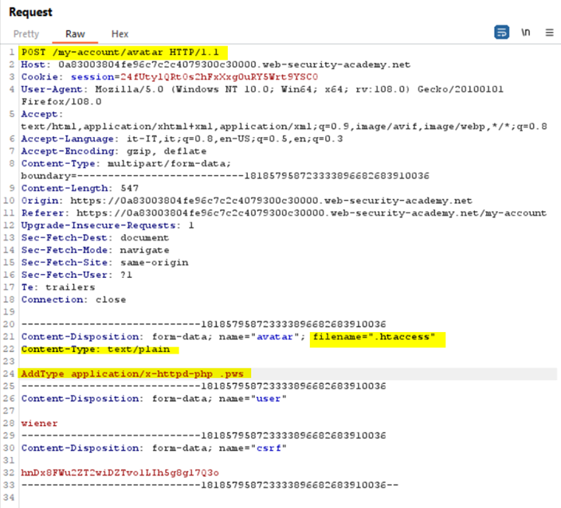
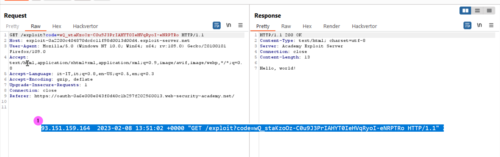

# Burp Exam Roadtrip
## Labs
### Web shell upload via extension blacklist bypass
<b>Concepts: Load an .httacces file to allow a file with a custom extension .pws to be executed as PHP file</b>
  
The httaccess file is uploaded  
 Upload your webshell as .pws file 
 Now inspect the source code of your account page 
 Visit the img src URL and you get the secret

### OAuth account hijacking via redirect_uri
<b>Workflow</b> 
Login to the portal using OAuth -> OAuth server authentication (yes) -> Portal (authenticated)  with auth code in the QS
  
In the repeater since we are already authenticated, we can see the cookie session already set
  
We can modify the redirect_uri parameter without get any error. The parameter is used to generate the redirect
  
Now redirect the request to our payload hosted into the exploit server
  
After delivered to the victim the payload, we can inspect the exploit access log to get the leaked auth code:
  
Now we can use the code to access the portal bypassing the authentication process:
https://YOUR-LABID.web-security-academy.net/oauth-callback?code=T2QW7SXUMEHWY_bpSSTnNucJRfhWhQRtbj2GQpqAINC
