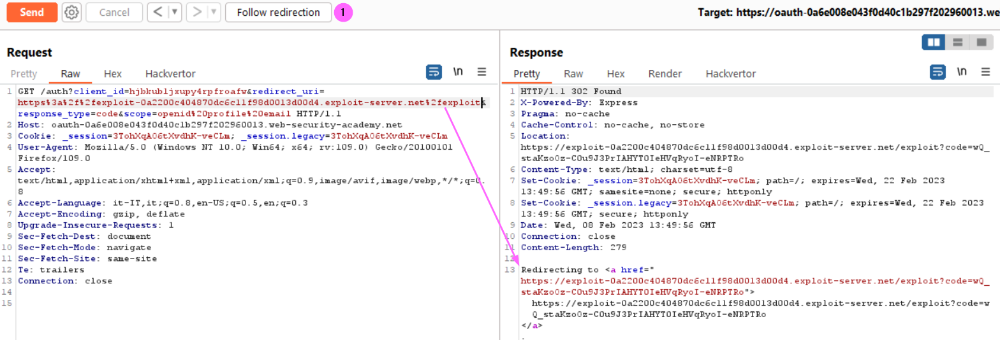

# Burp Exam Roadtrip
## Labs
### Web shell upload via extension blacklist bypass
<b>Concepts: Load an .httacces file to allow a file with a custom extension .pws to be executed as PHP file</b>
<br><br>
The httaccess file is uploaded<br> 
<br>Upload your webshell as .pws file<br>
<br>Now inspect the source code of your account page<br>
<br>Visit the img src URL and you get the secret

### OAuth account hijacking via redirect_uri
<b>Workflow</b><br/>
Login to the portal using OAuth -> OAuth server authentication (yes) -> Portal (authenticated)  with auth code in the QS
<br><br>
In the repeater since we are already authenticated, we can see the cookie session already set
<br><br>
We can modify the redirect_uri parameter without get any error. The parameter is used to generate the redirect
<br><br>
Now redirect the request to our payload hosted into the exploit server
<br><br>
After delivered to the victim the payload, we can inspect the exploit access log to get the leaked auth code:
<br><br>
Now we can use the code to access the portal bypassing the authentication process:
https://YOUR-LABID.web-security-academy.net/oauth-callback?code=T2QW7SXUMEHWY_bpSSTnNucJRfhWhQRtbj2GQpqAINC

### SSRF via flawed request parsing
In this lab we can take advantage of host header injection, just to recall what is the purpose of this header: https://www.rfc-editor.org/rfc/rfc7230#section-5.4
<br>First let’s try to modify the host value, we can notice that the request is blocked
<br><br>
Now we inspect the GET request providing the full path to our LAB URL, deleting the Host header, we notice that we get a valid response:
<br><br>
Since we know that the admin panel is locally accessible in the subnet 192.168.0.0/24, we can try to insert a test value in the Host parameter:
<br><br>
Here we get a timeout, but we also can notice that the Host value is used to resolve the URI provided into the GET parameter, now we can configure the Intruder to try to brute force the IP value, looking for a 200 or 302 (redirect) response.<br>
Set the payload parameter (1)
<br><br>
Then configure the payload as follows:
<br><br>
Run the Intruder (in the community it is time throttled):
<br><br>
Coming back to the repeater to modify the request according to the redirect:
<br><br>
Here we can see that posting a request to the <b>/admin/delete</b> passing the csrf token and the username parameters permit to delete a user. Modify the request according to the information we discovered and we solve the lab (see the picture in the next page). Here there is another very insecure flow, since the csrf token is transmitted even if we are not authenticated as an admin user, of course this scenario must be mitigated through an authentication mechanism. Additional information about csrf token generation can be found at https://portswigger.net/web-security/csrf/tokens 
<br><br>

### SSRF with blacklist-based input filter
Here we have a request parameter in the body, <b>stockApi</b>, that it used to verify the articles quantity present in stock:
<br><br>
We can try to access the localhost on the server:
<br><br>
We can see that there are some security mechanisms to prevent the access to localhost, same happens try to use 127.0.0.1. We can eventually try the not so well-known shorthand notation <b>127.1</b><br>
In this way we are able to bypass the security control that prevents us to access the localhost URL, and we were so lucky that the response indicates which is the URL to access the admin panel 😊
<br><br>
Trying to access the admin URL we receive again a security exception, suggesting us that another control is in place:
<br><br>
We can try to encode the admin string to bypass this control, a useful resource can be found at: https://book.hacktricks.xyz/pentesting-web/ssrf-server-side-request-forgery/url-format-bypass
<br>We can try to perform an URL encoding on the admin string:
<br><br>
And we got the following payload: <b>stockApi=http://127.1/%61%64%6d%69%6e</b> 
<br>Again, we got the same security exception’s message, we can try to double URL-encode the string as follows:
<br><b>stockApi=http://127.1/%25%36%31%25%36%34%25%36%64%25%36%39%25%36%65</b>
<br><br>
This time it worked, again the we got suggestion how to delete the user carlos, that it’s actual our lab’s goal, using the following payload we can solve the lab:
<br><b>stockApi=http://127.1/%25%36%31%25%36%34%25%36%64%25%36%39%25%36%65/delete?username=carlos</b><br>
(Don’t worry if you get a HTTP 302 error into the response, check the lab web app to verify that it is solved)


### SQL injection attack, querying the database type and version on MySQL and Microsoft
The Category parameter is injectable: find the number of columns that are returned by the query:
```
?category='+order+by+1--
```
But we get an internal server error, let’s try using another comment escape instruction (#)
<br><br>
We could infer that it is a MySQL DB and that the query returns 2 columns, looking at the page we can also infer that at least one column is textual. Try the follows payload confirm that idea:
<br><br>
Now get the DB version using the MySQL function VERSION()
<br><br>

### SQL injection attack, listing the database contents on non-Oracle databases
The category parameter is injectable
<br><br>
We can infer that the number of returned columns are 2, using the following payload:
```
?category='%20order%20by%202--
```
Looking at the response we can even infer that at least one column is a textual one, the following payload confirm that idea:
<br><br>
We can retrieve the DBMS version using the VERSION() function:
<br><br>
And we can get the list of all the user’s tables using the following view:
<br><br>
Using the following payload, we can get the name of the table’s columns
<br><br>
Now we can get all the entries for the user tables as follows:
<br><br>
Following you can find a useful link about Postgresql system queries: https://razorsql.com/articles/postgresql_system_queries.html 

### Exploiting cross-site scripting to capture passwords
This is actually a funny and a challenging lab. Taking advantage of a XSS stored vulnerability we have to access the blog as administrator user. We know that the comment field is injectable, lets analyze the flow:
<br><br>

First of all I thought to use the classic approach: stealing authentication cookie

