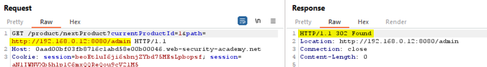
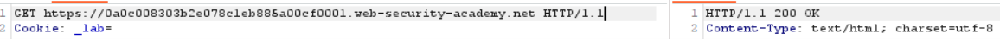
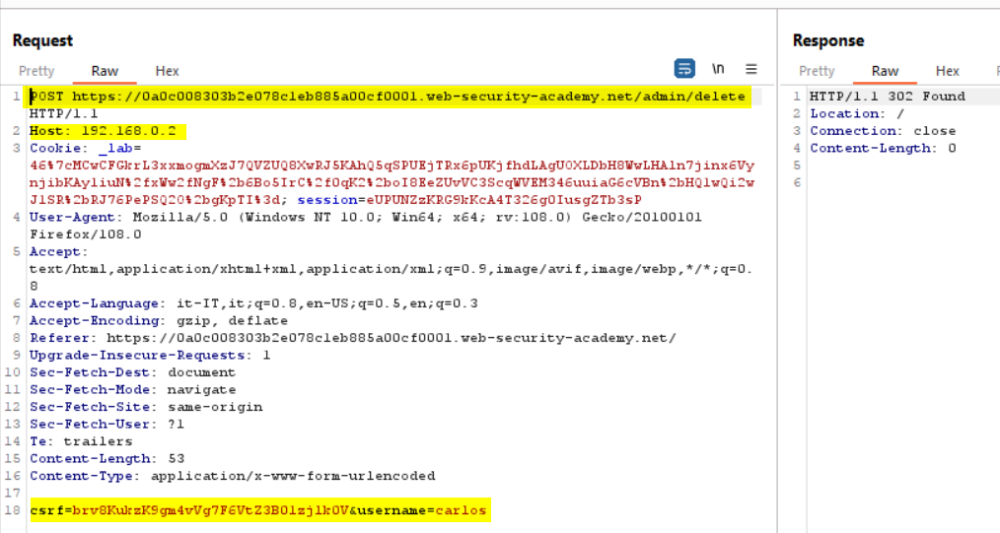
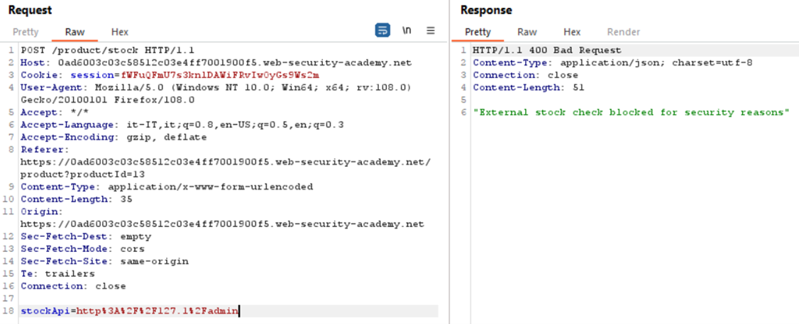

### SSRF with filter bypass via open redirection vulnerability
In order to solve the lab, we need to find an open redirect (https://portswigger.net/kb/issues/00500100_open-redirection-reflected) affecting the application to exploit the SSRF vulnerability.
First we can try to access the admin panel passing the URL into the body parameter, but it didn't work since a security check is in place:
<br><br>
Clicking the <b>Next product</b> link (bottom-right in the web page) we can notice that an open redirection is present (1), as reported into the server response (2)
<br><br>
As confirmation we can try to inject the query string parameter using the value highlighted:
<br><br>
Now we can proceed to exploit SSRF vulnerability providing the relative path with the QS parameter, to access the adim panel, into the stockApi parameter (1):<br>
<b>/product/nextProduct?path=http://192.168.0.12:8080/admin</b>. In the response we can find the URL to delete Carlos
<br><br>
And to solve the lab you can set the following payload:
```
stockApi=/product/nextProduct?path=http://192.168.0.12:8080/admin/delete?username=carlos
```

### SSRF via flawed request parsing
In this lab we can take advantage of host header injection, just to recall what is the purpose of this header: https://www.rfc-editor.org/rfc/rfc7230#section-5.4
<br>First let’s try to modify the host value, we can notice that the request is blocked
<br><br>
Now we inspect the GET request providing the full path to our LAB URL, deleting the Host header, we notice that we get a valid response:
<br><br>
Since we know that the admin panel is locally accessible in the subnet 192.168.0.0/24, we can try to insert a test value in the Host parameter:
<br><br>
Here we get a timeout, but we also can notice that the Host value is used to resolve the URI provided into the GET parameter, now we can configure the Intruder to try to brute force the IP value, looking for a 200 or 302 (redirect) response.<br>
Set the payload parameter (1)
<br><br>
Then configure the payload as follows:
<br><br>
Run the Intruder (in the community it is time throttled):
<br><br>
Coming back to the repeater to modify the request according to the redirect:
<br><br>
Here we can see that posting a request to the <b>/admin/delete</b> passing the csrf token and the username parameters permit to delete a user. Modify the request according to the information we discovered and we solve the lab (see the picture in the next page). Here there is another very insecure flow, since the csrf token is transmitted even if we are not authenticated as an admin user, of course this scenario must be mitigated through an authentication mechanism. Additional information about csrf token generation can be found at https://portswigger.net/web-security/csrf/tokens 
<br><br>

### SSRF with blacklist-based input filter
Here we have a request parameter in the body, <b>stockApi</b>, that it used to verify the articles quantity present in stock:
<br><br>
We can try to access the localhost on the server:
<br><br>
We can see that there are some security mechanisms to prevent the access to localhost, same happens try to use 127.0.0.1. We can eventually try the not so well-known shorthand notation <b>127.1</b><br>
In this way we are able to bypass the security control that prevents us to access the localhost URL, and we were so lucky that the response indicates which is the URL to access the admin panel 😊
<br><br>
Trying to access the admin URL we receive again a security exception, suggesting us that another control is in place:
<br><br>
We can try to encode the admin string to bypass this control, a useful resource can be found at: https://book.hacktricks.xyz/pentesting-web/ssrf-server-side-request-forgery/url-format-bypass
<br>We can try to perform an URL encoding on the admin string:
<br><br>
And we got the following payload: <b>stockApi=http://127.1/%61%64%6d%69%6e</b> 
<br>Again, we got the same security exception’s message, we can try to double URL-encode the string as follows:
<br><b>stockApi=http://127.1/%25%36%31%25%36%34%25%36%64%25%36%39%25%36%65</b>
<br><br>
This time it worked, again the we got suggestion how to delete the user carlos, that it’s actual our lab’s goal, using the following payload we can solve the lab:
<br><b>stockApi=http://127.1/%25%36%31%25%36%34%25%36%64%25%36%39%25%36%65/delete?username=carlos</b><br>
(Don’t worry if you get a HTTP 302 error into the response, check the lab web app to verify that it is solved)

### SSRF via OpenID dynamic client registration
<b>OpenID Connect extends the OAuth protocol to provide a dedicated identity and authentication layer</b> that sits on top of the basic OAuth implementation. It adds some simple functionality that enables better support for the authentication use case of OAuth. OAuth was initially intended to be a means of delegating authorizations, not a means to authentication. OpenID Connect provides standardized, identity-related features to make authentication via OAuth work in a more reliable way. 

Unlike basic OAuth, whose <b>scopes are unique to each provider</b>, all OpenID Connect services use an identical set of scopes. In order to use OpenID Connect, the client application must specify the scope openid in the authorization request. Each of these scopes corresponds to read access for a subset of claims - <b>claims refers to the key:value pairs that represent information about the user on the resource server, e.g "family_name":"Simpsons"</b> - about the user that are defined in the OpenID specification. 

The other main addition provided by OpenID Connect is the <b>id_token</b> response type. This returns a JSON web token (JWT) signed with a JSON web signature (JWS). The JWT payload contains a list of claims based on the scope that was initially requested. It also contains information about how and when the user was last authenticated by the OAuth service. The client application can use this to decide whether or not the user has been sufficiently authenticated. 

#### Lab
The lab allows client applications to dynamically register themselves with the OAuth service via a dedicated registration endpoint. Some client-specific data is used in an unsafe way by the OAuth service, which exposes a potential vector for SSRF.

To solve the lab, we have to perform a SSRF attack to access http://169.254.169.254/latest/meta-data/iam/security-credentials/admin and steal the secret access key for the OAuth provider's cloud environment.

You can log in to your own account using the following credentials: wiener:peter.

First of all we can try to access the OpenId configuration file at the oauth server. To find the server name proceed to login using the social media and look into the proxy history, you will see a request similar to the follows

    GET /auth?client_id=mm2rows2xyshg2hlgco08&redirect_uri=https://0a38001e046dfef1c37d749a00630040.web-security-academy.net/oauth-callback&response_type=code&scope=openid%20profile%20email HTTP/1.1
    Host: oauth-0ad700900440fe10c36e72fb021b00ae.web-security-academy.net

In my lab I can access the config file visiting:

    https://oauth-0ad700900440fe10c36e72fb021b00ae.web-security-academy.net/.well-known/openid-configuration

Find the registration end point as shown below:
<br><br>
We can try to register our client application without specify any bearer token (that of course we don't know) to check if open registration is allowed. The minimal request must include at least a <b>redirect_uris</b> array</> containing an arbitrary whitelist of callback URIs for the application:
<br><br>

So the registration is open, that's good for us, now we have to find the SSRF vulnerability. Honestly I had to peek to the solution since I was not able to identify the proper injection point :(, that actualy is the client logo image that it is displayed 
<br><br>
We know from the OpenId specification that client applications can provide the URL for their logo using the <b>logo_uri</b> property during dynamic registration, let's try to see if we can use this property to perform a SSRF attack. First send the logo requesto to Repeater (in case you are not able to repeat the log-in process access the lab using an private browser's session to intercept the flow).

    GET /client/mm2rows2xyshg2hlgco08/logo HTTP/1.1
    Host: oauth-0ad700900440fe10c36e72fb021b00ae.web-security-academy.net

Then in Repeater modify the previous used request to regestir to the OpenId server as follows:

    POST /reg HTTP/1.1
    Host: oauth-0ad700900440fe10c36e72fb021b00ae.web-security-academy.net
    Content-Type: application/json
    Content-Length: 67

    {
        "redirect_uris" : [
            "https://example.com"
        ],
        "logo_uri" : "http://burpcollaborator.net/"
    }

Here I set the logo uri to point to the collaborator server to test if the request takes place. In the response find the client id value:

    "client_id":"eeVjhXQiHzatLNlvhFx76"

Take the value and replace it with the one present into the GET request for the logo that we have previously intercepted, send the request and
we can see that we were able to access the Collaborator server using the client logo image URI. Knowing that we can change the <b>logo_uri</b> value to point to admin access credential's URI and register again our client app:
<br><br>
Now repeat the same step and send the request for the URI logo using the new client id:
<br><br>
In the response we can see the admin's secret access key.


#### References
- https://portswigger.net/web-security/oauth/openid 
- https://docs.gitlab.com/ee/integration/openid_connect_provider.html
- https://connect2id.com/products/server/docs/guides/client-registration