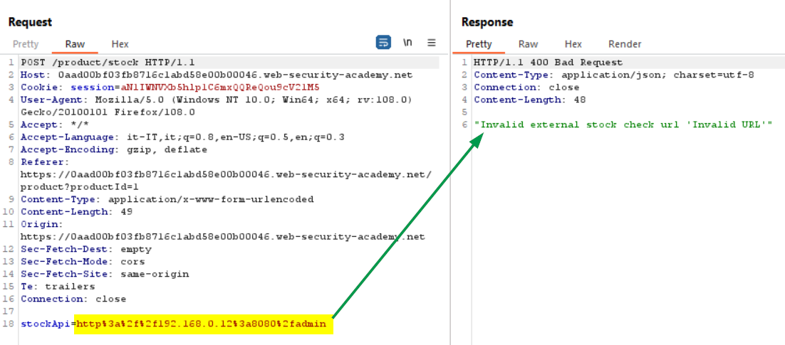
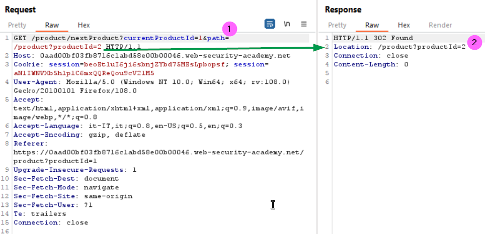
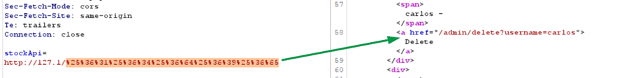

### SSRF with filter bypass via open redirection vulnerability
In order to solve the lab, we need to find an open redirect (https://portswigger.net/kb/issues/00500100_open-redirection-reflected) affecting the application to exploit the SSRF vulnerability.
First we can try to access the admin panel passing the URL into the body parameter, but it didn't work since a security check is in place:
<br><br>
Clicking the <b>Next product</b> link (bottom-right in the web page) we can notice that an open redirection is present (1), as reported into the server response (2)
<br><br>
As confirmation we can try to inject the query string parameter using the value highlighted:
<br><br>
Now we can proceed to exploit SSRF vulnerability providing the relative path with the QS parameter, to access the adim panel, into the stockApi parameter (1):<br>
<b>/product/nextProduct?path=http://192.168.0.12:8080/admin</b>. In the response we can find the URL to delete Carlos
<br><br>
And to solve the lab you can set the following payload:
```
stockApi=/product/nextProduct?path=http://192.168.0.12:8080/admin/delete?username=carlos
```

### SSRF via flawed request parsing
In this lab we can take advantage of host header injection, just to recall what is the purpose of this header: https://www.rfc-editor.org/rfc/rfc7230#section-5.4
<br>First let’s try to modify the host value, we can notice that the request is blocked
<br><br>
Now we inspect the GET request providing the full path to our LAB URL, deleting the Host header, we notice that we get a valid response:
<br><br>
Since we know that the admin panel is locally accessible in the subnet 192.168.0.0/24, we can try to insert a test value in the Host parameter:
<br><br>
Here we get a timeout, but we also can notice that the Host value is used to resolve the URI provided into the GET parameter, now we can configure the Intruder to try to brute force the IP value, looking for a 200 or 302 (redirect) response.<br>
Set the payload parameter (1)
<br><br>
Then configure the payload as follows:
<br><br>
Run the Intruder (in the community it is time throttled):
<br><br>
Coming back to the repeater to modify the request according to the redirect:
<br><br>
Here we can see that posting a request to the <b>/admin/delete</b> passing the csrf token and the username parameters permit to delete a user. Modify the request according to the information we discovered and we solve the lab (see the picture in the next page). Here there is another very insecure flow, since the csrf token is transmitted even if we are not authenticated as an admin user, of course this scenario must be mitigated through an authentication mechanism. Additional information about csrf token generation can be found at https://portswigger.net/web-security/csrf/tokens 
<br><br>

### SSRF with blacklist-based input filter
Here we have a request parameter in the body, <b>stockApi</b>, that it used to verify the articles quantity present in stock:
<br><br>
We can try to access the localhost on the server:
<br><br>
We can see that there are some security mechanisms to prevent the access to localhost, same happens try to use 127.0.0.1. We can eventually try the not so well-known shorthand notation <b>127.1</b><br>
In this way we are able to bypass the security control that prevents us to access the localhost URL, and we were so lucky that the response indicates which is the URL to access the admin panel 😊
<br><br>
Trying to access the admin URL we receive again a security exception, suggesting us that another control is in place:
<br><br>
We can try to encode the admin string to bypass this control, a useful resource can be found at: https://book.hacktricks.xyz/pentesting-web/ssrf-server-side-request-forgery/url-format-bypass
<br>We can try to perform an URL encoding on the admin string:
<br><br>
And we got the following payload: <b>stockApi=http://127.1/%61%64%6d%69%6e</b> 
<br>Again, we got the same security exception’s message, we can try to double URL-encode the string as follows:
<br><b>stockApi=http://127.1/%25%36%31%25%36%34%25%36%64%25%36%39%25%36%65</b>
<br><br>
This time it worked, again the we got suggestion how to delete the user carlos, that it’s actual our lab’s goal, using the following payload we can solve the lab:
<br><b>stockApi=http://127.1/%25%36%31%25%36%34%25%36%64%25%36%39%25%36%65/delete?username=carlos</b><br>
(Don’t worry if you get a HTTP 302 error into the response, check the lab web app to verify that it is solved)
