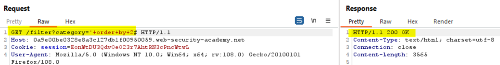
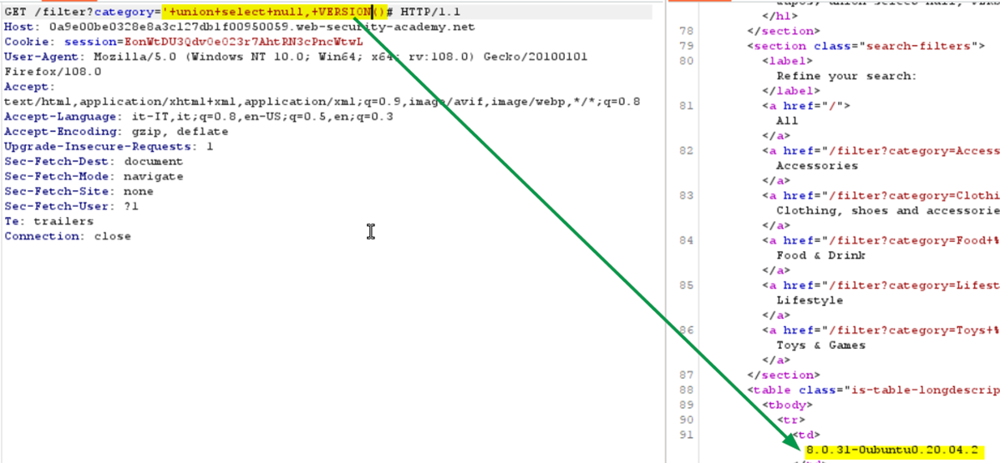
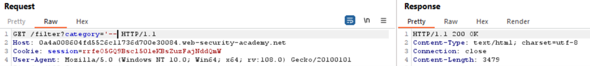

### SQL injection attack, querying the database type and version on MySQL and Microsoft
The Category parameter is injectable: find the number of columns that are returned by the query:
```
?category='+order+by+1--
```
But we get an internal server error, let’s try using another comment escape instruction (#)
<br><br>
We could infer that it is a MySQL DB and that the query returns 2 columns, looking at the page we can also infer that at least one column is textual. Try the follows payload confirm that idea:
<br><br>
Now get the DB version using the MySQL function VERSION()
<br><br>

### SQL injection attack, listing the database contents on non-Oracle databases
The category parameter is injectable
<br><br>
We can infer that the number of returned columns are 2, using the following payload:
```
?category='%20order%20by%202--
```
Looking at the response we can even infer that at least one column is a textual one, the following payload confirm that idea:
<br><br>
We can retrieve the DBMS version using the VERSION() function:
<br><br>
And we can get the list of all the user’s tables using the following view:
<br><br>
Using the following payload, we can get the name of the table’s columns
<br><br>
Now we can get all the entries for the user tables as follows:
<br><br>
Following you can find a useful link about Postgresql system queries: https://razorsql.com/articles/postgresql_system_queries.html 
