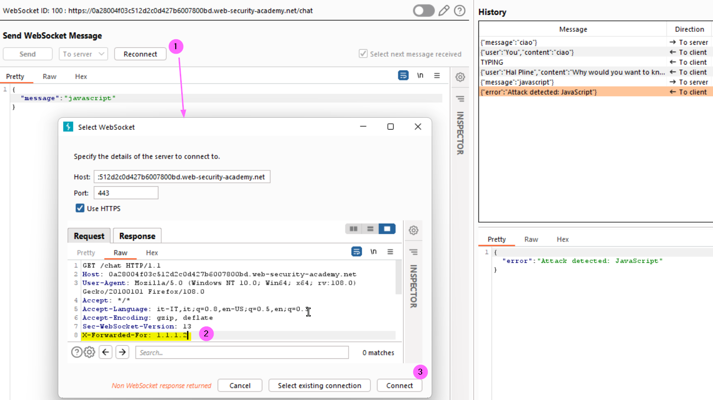
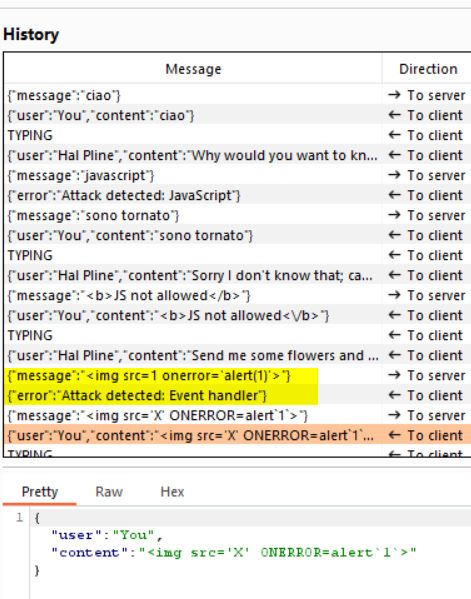

### Manipulating the WebSocket handshake to exploit vulnerabilities
#### Lab
This online shop has a live chat feature implemented using WebSockets, that has an aggressive but flawed XSS filter.
To solve the lab, use a WebSocket message to trigger an alert() popup in the support agent's browser.
As usual visit the Live chat web page to confirm that the communication take place using a web-socket, try to send a message and you will se that the support teams in quite unpolite :). In Proxy go to the Web sockets history, find the request send to the server related to your message, the body should look like that:
```
{"message":"ciao"}
```
Send the request to the Repeater, changing the message value to the string <b>javascript</b> rise an error, so we know that there is some kind of protection, problably using a simple wordlist. Now that are IP is blocked we can try to evade the block using the <b>X-Forworded-For</b> header to fake our current IP, so click Reconnect (1), in the new window in the request insert the header with a dummy value (2), then click Connect (3)
<br><br>
Then I tried another payload without 'javascript' word
```
{"message":""}
```
but even this time the attack was blocked and I hade to reconnect again using another faked IP. I tried some other escape techniques but without success, so yes, I had to take a look at the solution :( to get a working payload:
```
{"message":""}
```
Here we use the <b>case change for the onerror event and the template literals for the alert funcion</b>. That permits to solve the lab
<br><br>
#### References
+ https://portswigger.net/web-security/websockets
+ https://developer.mozilla.org/en-US/docs/Web/JavaScript/Reference/Template_literals
+ https://developer.mozilla.org/en-US/docs/Web/HTTP/Headers/X-Forwarded-For
