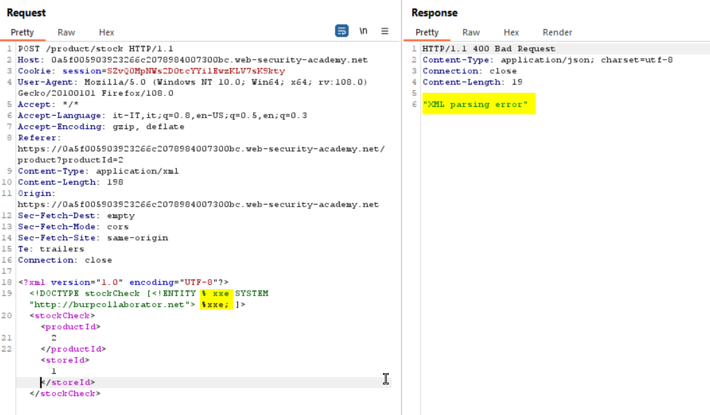
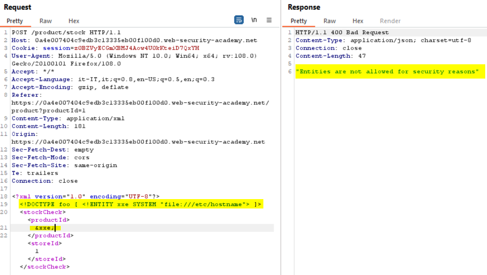
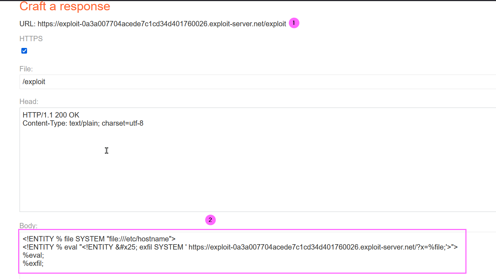
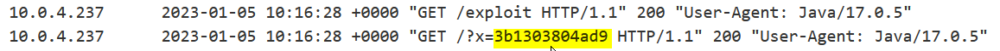

### Blind XXE with out-of-band interaction via XML parameter entities
In this lab the application does not return the values of any defined external entities in its responses, and so direct retrieval of server-side data is not possible as shown below:
  
Then we have to proceed performing a blind out-of-band injection using XML parameter entities (more information: https://portswigger.net/web-security/xxe/blind). Using the following payload we can solve the lab:
  
Since I use the Community version I cannot take advantage of the Collaborator feature to obtain a valid subdomain, but we can refer to the domain <b>burpcollaborator.net</b> as our XML parameter value, even if we won't see the requests arriving to the server (DNS and HTTP), the lab is solved anyway.
Note that even if the we get an error into the response the call to the collaborator site is performed.

### Exploiting blind XXE to exfiltrate data using a malicious external DTD
 This lab has a "Check stock" feature that parses XML input but does not display the result, to solve the lab, exfiltrate the contents of the /etc/hostname file. 
 Trying a classic XXE injection confirm that we have to perform a blind XXE:
  
We are going to use the exploit server to store a malicious DTD:
   
The body contains the DTD (2) that performs the following:

1. Defines an XML parameter entity called file, containing the contents of the /etc/hostname file.
2. Defines an XML parameter entity called eval, containing a dynamic declaration of another XML parameter entity called exfil. The exfil entity will be evaluated by making an HTTP request to the exploit LAB web server root containing the value of the file entity within the URL query string.
3. Uses the eval entity, which causes the dynamic declaration of the exfil entity to be performed.
4. Uses the exfil entity, so that its value is evaluated by requesting the specified URL.

Then we will invoke the external DTD URL (1) from within the in-band XXE payload:
  

Then inspecting the exploit LAB server access log we get the value of the hostname in the URL query string:
  

