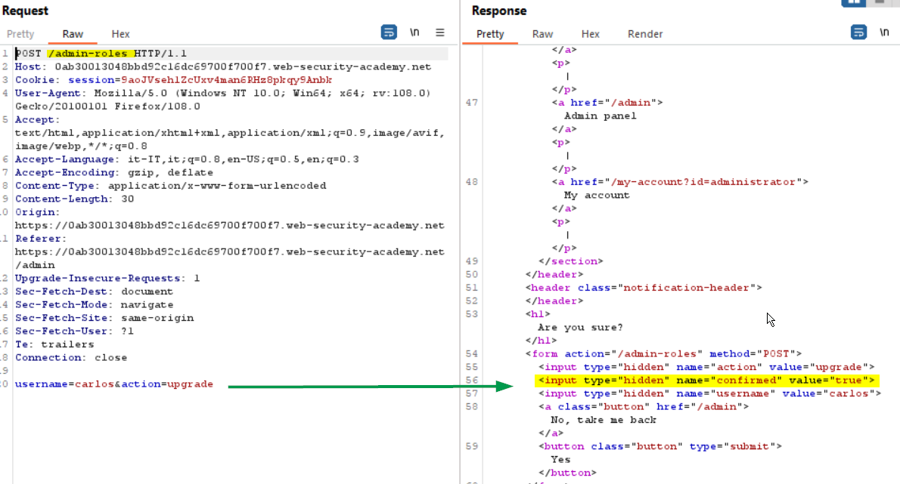
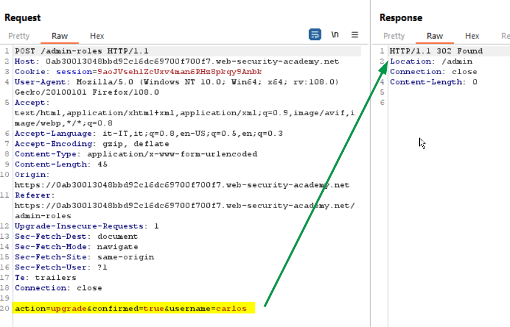
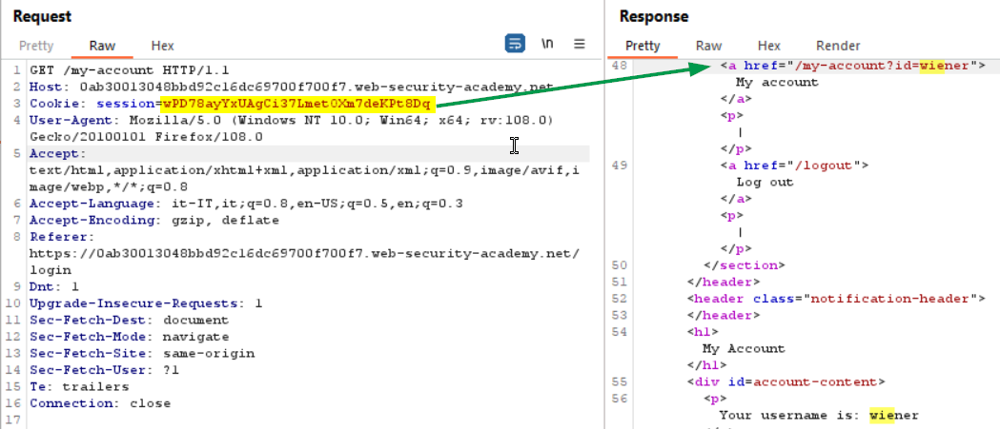
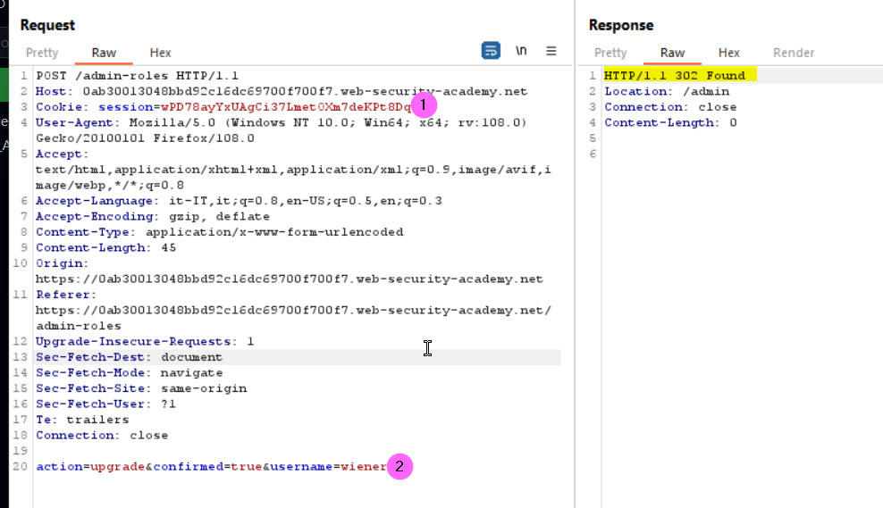
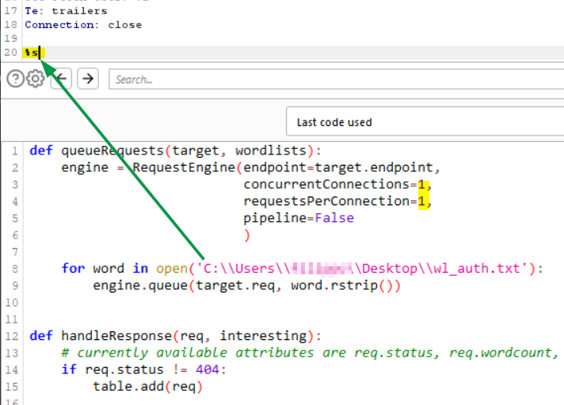
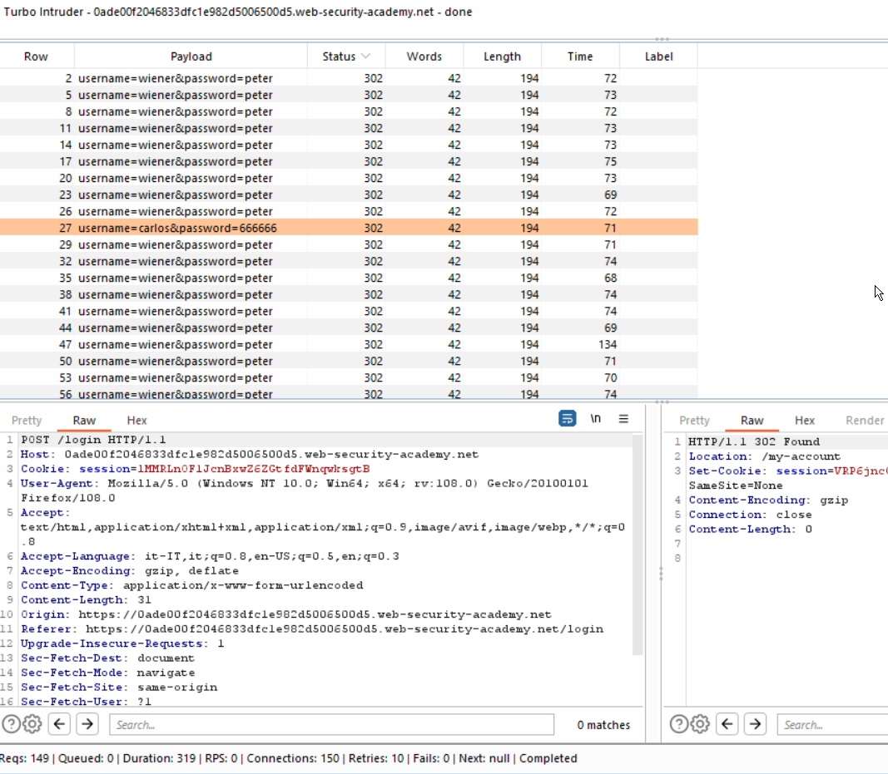

### OAuth account hijacking via redirect_uri
<b>Workflow</b><br/>
Login to the portal using OAuth -> OAuth server authentication (yes) -> Portal (authenticated)  with auth code in the QS
<br><br>
In the repeater since we are already authenticated, we can see the cookie session already set
<br><br>
We can modify the redirect_uri parameter without get any error. The parameter is used to generate the redirect
<br><br>
Now redirect the request to our payload hosted into the exploit server
<br><br>
After delivered to the victim the payload, we can inspect the exploit access log to get the leaked auth code:
<br><br>
Now we can use the code to access the portal bypassing the authentication process:
https://YOUR-LABID.web-security-academy.net/oauth-callback?code=T2QW7SXUMEHWY_bpSSTnNucJRfhWhQRtbj2GQpqAINC

### Multi-step process with no access control on one step 
### Lab
This lab has an admin panel with a flawed multi-step process for changing a user's role. 
To solve the lab, log in using the credentials wiener:peter and exploit the flawed access controls to promote yourself to become an administrator.
Before to promote a user as admin 
<br><br>

A confirmation step is required. In this step an hiddne input field is sent to validate the action as show below
<br><br>
In this scenario, since no security mechanism are implemented in the confirmation step, we can easely promote oruselves to an admin user. Let's try lo open an incognito session in the browser to login as a normal user (wiener)
<br><br>
Now in the legitim request made before by the administrator to promote carlos, we can just change the cookie session to ours (1) and the username parameter according (2):
<br><br>
Submitting the modified request we solve the lab

#### References:
+ https://portswigger.net/web-security/access-control

### Broken brute-force protection with IP block
#### Lab
This lab is vulnerable due to a logic flaw in its password brute-force protection. To solve the lab, brute-force the victim's password, then log in and access their account page.

Trying to brute-force the login we can notice that after 3 failed attempts we are blocked for 1 minute, so a lock-out policy it is in place. Now it is quite common that the policy is based on the IP address of the incoming request. Poorly configured policy reset the failed counter attempts after a successfull login, we can try to verify this configuration using the following approach within a minute:
+ 2 failed login using carlos as username
+ a succefull login as user wiener
+ another failed attempt as user carlos
The result is that we are not blocked, so we can try to brute-force the login using the following sequence:
+ login brute-force attempt 1
+ login brute-force attempt 2
+ successfull login user wiener credentials
+ login brute-force attempt 3
+ login brute-force attempt 4
+ successfull login user wiener credentials
+ ...

and so on. To solve this lab I used Turbo Intruder exstension, you can get more information in the reference section about this toool. I created a custom list to feed Turbo intruder based on the passwords list provided: https://portswigger.net/web-security/authentication/auth-lab-passwords, that implements the sequence schema illustrated above. You can download the customized list for Turbo Intrudere [here](./file/wl_auth.txt).

Once we have intercepted a login request we can send it to Turbo Intruder, here I configured the Python payload to execute a request after another, so I set
```
concurrentConnections=1,
requestperConnetction=1,
```
and the wordlist that I created. The payload will send a request for each line in the file, replacing the <b>%s</b>
value with the a single payload row of the file, then if the response is not a 404 error, is added to the list results.
<br><br>

Now lunch the attack, go for a coffee since it will take some time (in Burp CE using Turbo Intruder the requests are throttled). 

In the result's table to find out if we succeed, we have to order the results for the state, looking for 302 responses (redirection to the account details), filter out those related to wiener, we should see a request having carlos as username, the value of the password parameter is the one that is correct.
<br><br>


#### References:
+ https://blog.intigriti.com/2022/03/01/hacker-tools-turbo-intruder/

### JWT authentication bypass via weak signing key
JWT attacks involve a user sending modified JWTs to the server in order to achieve a malicious goal. Typically, this goal is to bypass authentication and access controls by impersonating another user who has already been authenticated. 
#### Lab
This lab uses a JWT-based mechanism for handling sessions. It uses an extremely weak secret key to both sign and verify tokens. This can be easily brute-forced. To solve the lab, first brute-force the website's secret key. Once you've obtained this, use it to sign a modified session token that gives you access to the admin panel at /admin, then delete the user carlos.

You can log in to your own account using the following credentials: wiener:peter 
#### References
+ https://portswigger.net/web-security/jwt
+ https://portswigger.net/web-security/jwt/working-with-jwts-in-burp-suite
+ https://jwt.io
