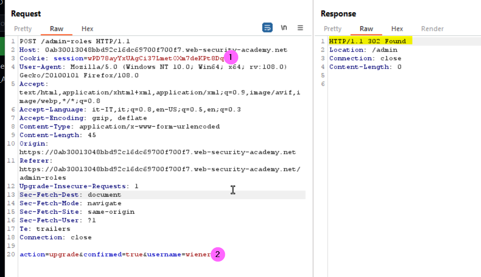

### Multi-step process with no access control on one step 
### Lab
This lab has an admin panel with a flawed multi-step process for changing a user's role. 
To solve the lab, log in using the credentials wiener:peter and exploit the flawed access controls to promote yourself to become an administrator.
Before to promote a user as admin 
  

A confirmation step is required. In this step an hiddne input field is sent to validate the action as show below
  
In this scenario, since no security mechanism are implemented in the confirmation step, we can easely promote oruselves to an admin user. Let's try lo open an incognito session in the browser to login as a normal user (wiener)
  
Now in the legitim request made before by the administrator to promote carlos, we can just change the cookie session to ours (1) and the username parameter according (2):
  
Submitting the modified request we solve the lab

#### References:
+ https://portswigger.net/web-security/access-control
