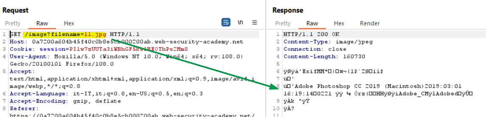
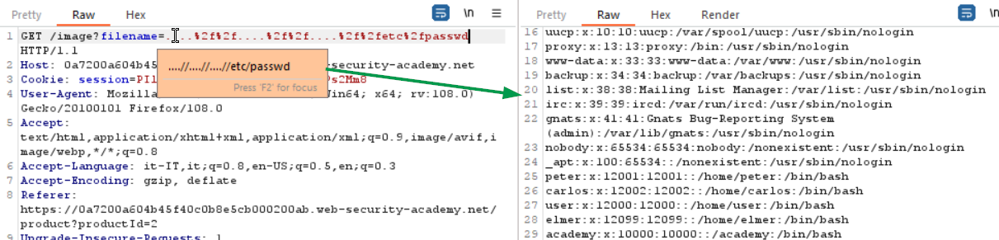

### File path traversal, traversal sequences stripped non-recursively
#### LAB
The lab contains a file path traversal vulnerability in the display of product images,
but the application strips path traversal sequences from the user-supplied filename before using it.
<br>
To solve the lab, retrieve the contents of the /etc/passwd file. 

To visualize an image the application takes a query string parameter as a file name:
<br><br>

Try to inject the absolute path for the passwd file did not work, the server responds with a bad request: <b>No such file</b>. We can think that the image directory could be <b>/var/www/img/</b>, so we could try to enter the path traversal sequence (../) three times, so we will reache the root of the file system and then we will enter into <b>etc</b> directory. The payload will be:
```
?filename=../../../etc/passwd
```
Knowing that the security filter delete the traversal sequence (../) we can try to use a <b>nested traversal sequence: (....//)</b>. The application will strip the inner file path traversal sequence, but hopefully will leaves the (../) sequence. Let's try:
<br><br>


#### Reference
+ https://portswigger.net/web-security/file-path-traversal
+ https://kadalonsecurity.medium.com/using-nested-traversal-sequences-to-bypass-file-path-traversal-defense-3982feb4e60b
