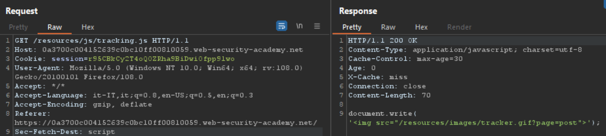
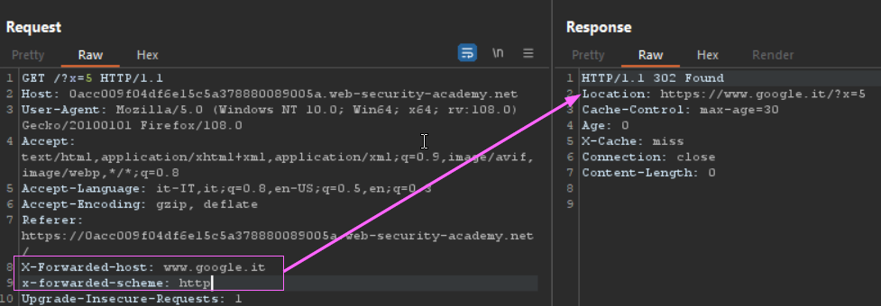
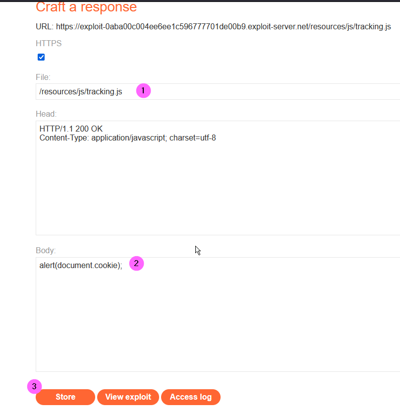
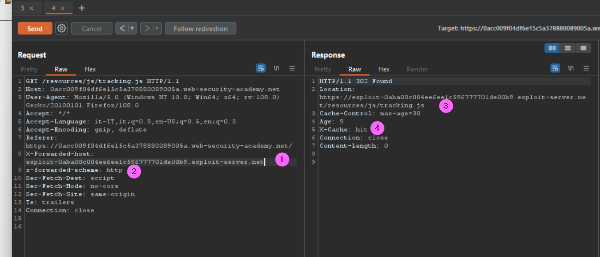
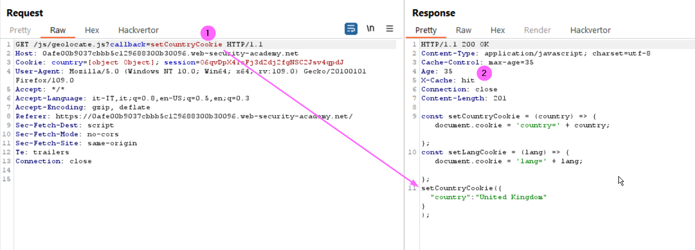
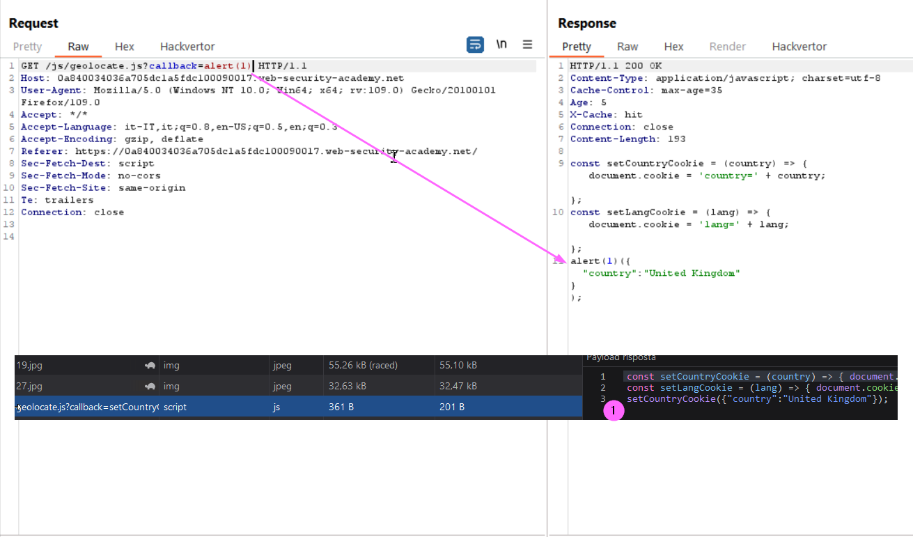
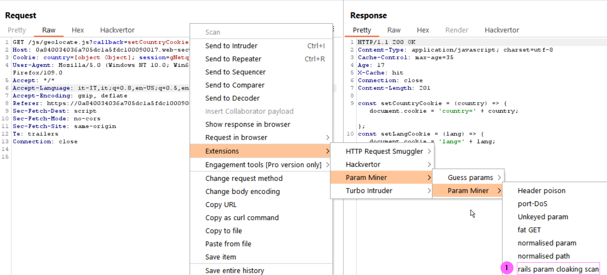

### Web cache poisoning with multiple headers
#### Lab
The lab contains a web cache poisoning vulnerability that is only exploitable when you use multiple headers to craft a malicious request. A user visits the home page roughly once a minute. To solve this lab, poison the cache with a response that executes alert(document.cookie) in the visitor's browser.
<b>Hints: The requests  supports both the X-Forwarded-Host and X-Forwarded-Scheme headers. </b>

Inspecting the requests we can see that a JS script is used in the Home page:
<br><br>

We could code an malicious version of this script to be delivered to the visitors to solve the lab, to do that of course first we have to find out if the application is vulnerable to cache poisoning. To automate the headers analysis I used the wonderful tool <b>Web-Cache-Vulnerability-Scanner</b> (more info in the [reference](#references) section). Executing the program as follows:
```
 .\wcvs.exe -u https://0acc009f04df6e15c5a378880089005a.web-security-academy.net -ppath .\BurpCer.pem -ot headers -hw '.\wordlists\lab'

[ERR] Published by Hackmanit under http://www.apache.org/licenses/LICENSE-2.0
[ERR] Author: Maximilian Hildebrand
[ERR] Repository: https://github.com/Hackmanit/Web-Cache-Vulnerability-Scanner

[ERR] WCVS v1.1.0 started at 2023-01-19_09-41-36
[ERR]
Testing website(1/1): https://0acc009f04df6e15c5a378880089005a.web-security-academy.net
....
| Header Poisoning
 --------------------------------------------------------------
[ERR] Testing 2 headers
[ERR] Unexpected Status Code 302 for 1st request of header X-Forwarded-Scheme
[ERR] Unexpected Status Code 302 for 2nd request of header X-Forwarded-Scheme
[ERR]
[ERR] Header X-Forwarded-Scheme was successfully poisoned! cb: 933918142027 poison: 624564716619
[ERR] URL: https://0acc009f04df6e15c5a378880089005a.web-security-academy.net?cb=933918142027
[ERR] Reason: Status Code 302 differed from 200
...
[ERR] Successfully finished the scan
[ERR] Duration: 2.8823452s
```
I used the following parameters
+ -ppath = path to Burp certification file in PEM format (if you have installed the certificate in FF, visualizing it then you have the option to export it as PEM file) 
+ -ot = test only headers
+ -hw = custom word list that contains only X-Forwarded-Host and X-Forwarded-Scheme

Using the -ppath option implies to use the Burp proxie. As we can see from the output we were able to identify that the <b>X-Forwarded-Scheme</b> can be poisoned, but nothing is reported for the X-Forwarded-Host header. Anyway I tried to send a request with both the parameters set
```
X-Forwarded-host: www.google.it
x-forwarded-scheme: https
```
In this case nothing happens and I got a 200 response. Indeed changing the protocol to http we get a redirect to the X-Forwarded-host value:
<br><br>

Knowing that we can try to poison the server cache for the script <b>/resources/js/tracking.js</b> to poin to the exploit server (2), inserting the exploit (2). Click store (3) to save.
<br><br>

Now modify in Repeater modify the request for the script as follows:
<br><br>

Here the x-forwarded-host points to the exploit server that hosts the malicious script (1), setting the x-forwarded-scheme to http (2) will trigger the redirection to the malicious script URI (3). Keep submitting the request until you get <b>x-cache: hit</b> in the response (4), that means that the resources has been cached.

Now reloading the home page you should get the alert pop-up, and the lab should be solved

#### References
+ https://portswigger.net/web-security/web-cache-poisoning
+ https://github.com/Hackmanit/Web-Cache-Vulnerability-Scanner

### Parameter cloaking
What is parameter cloaking? A web cache poisoning vector called through which an attacker can separate query parameters using a semicolon <b>;</b>, that can cause a difference in the interpretation of the request between the proxy (running with default configuration) and the server. This can result in malicious requests being cached as completely safe ones, as the proxy would usually not see the semicolon as a separator, and therefore would not include it in a cache key of an unkeyed parameter.
#### Lab
The  lab is vulnerable to web cache poisoning because it excludes a certain parameter from the cache key. There is also inconsistent parameter parsing between the cache and the back-end. A user regularly visits this site's home page using Chrome.
To solve the lab, use the parameter cloaking technique to poison the cache with a response that executes alert(1) in the victim's browser. 

<i>Please note that I was not able to solve the Lab by my own, so I hade to follow the solution provided. In this Lab I used the Param miner exstension, also the Lab Id will change during the solution's explanation</i>

First of all we have to identify the request to the js file, then send it to Repeater. Here we can see that the callback parameter value (1) is reflected into the response, and then it is cached (2).
<br><br>
Changing the parameter's value and we can see that it is reflected into the response, and again the request is cached, but we can't poison the cache for other users in this way because the parameter is keyed. That's confirmed reloading the home that includes the original script's request (1)
<br><br>
That's a normal behaviour since the query string parameter takes part into forming the key cache value.

Since we know that we can exploi the application using parameter cloaking as indicated, we need to find a suitable unkeyed parameter. Let's proceed using the Param miner exstension as shown (1):
<br><br>
It ok in the config windows and proceed to test the applications. After a while looking at the output we can see that an unkeyed parameter has been founf
```
Found issue: Web Cache Poisoning: Parameter Cloaking
Target: https://0a840034036a705dc1a5fdc100090017.web-security-academy.net
The application can be manipulated into excluding the callback parameter from the cache key, by disguising it as utm_content. <br>For further information on this technique, please refer to https://portswigger.net/research/web-cache-entanglement
Evidence: 
======================================
GET /js/geolocate.js?callback=setCountryCookie&utm_content=x;callback=akzldka&g93s8=1 HTTP/1.1
```
If we execute the payload from Reapeater we can see that now we are able to cache the callback parameter with our malicious payload (send the request until you hit the cache). As we can see now the last callback parameter, after the utm_content parameter separated by a semicolon, it is excluded from the cache key but it is used by the server to overwrite the callback function in the response:
<br><br>
Change the GET request has follows (remember to hit the cache again) and we can solve the lab

    GET /js/geolocate.js?callback=setCountryCookie&utm_content=x;callback=alert(1)


#### References
+ https://www.radware.com/cyberpedia/application-security/parameter-cloaking
+ https://portswigger.net/web-security/web-cache-poisoning/exploiting-implementation-flaws
+ https://blog.detectify.com/2020/07/28/do-you-trust-your-cache-web-cache-poisoning-explained/
